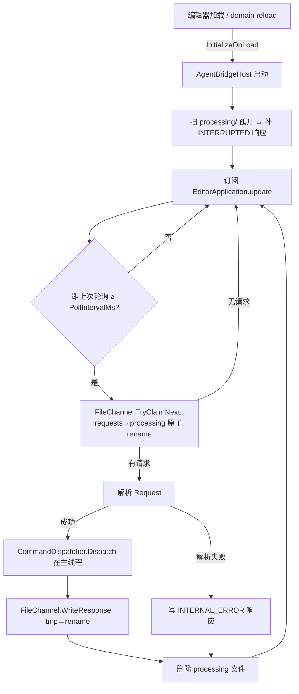

# bridge-core design

## 0. 术语约定

| 术语 | 定义 | 防冲突 |
|---|---|---|
| AgentBridge | 本系统统称:Agent 通过文件驱动 Unity 编辑器 | 空仓库,无冲突 |
| Request / Response | Agent↔Unity 的 JSON 信封(见 file-bridge 4.1) | 全新类型,放 AgentBridge 命名空间 |
| Command | 一条可执行操作的名字(对应 `[Command("…")]`) | 与 Unity `MenuItem`/`CommandContext` 无关,独立概念 |
| Handler | 实现 `ICommandHandler` 的命令处理器 | 全新 |
| Claim(认领) | Unity 把 `requests/` 文件原子 rename 到 `processing/` 以独占处理 | 全新 |
| Domain reload | Unity 重编译后重置 AppDomain、丢失静态状态的事件 | Unity 既有概念,沿用 |

grep 防冲突:仓库为空,无既有代码/术语冲突。命名空间统一 `AgentBridge`。

## 1. 决策与约束

### 需求摘要
- **做什么**:实现文件通讯桥接的最小可运行骨架——Agent 写请求 JSON 文件,Unity 编辑器轮询认领、在主线程执行、写回响应 JSON 文件,Agent 读回。
- **为谁**:驱动 Unity 编辑器做自动化的 AI Agent(Claude Code);以及后续所有命令 feature / extension-manager(它们都挂在本 feature 的 handler 框架上)。
- **成功标准**:编辑器内启动桥接后,Agent 写一个 `command=ping` 的请求文件,200ms 量级内在 `responses/` 得到 `status=ok` 且 `result` 含 pong 标记、`id` 回显的响应。
- **明确不做**(本 feature):
  - 除 `ping` 外的任何业务命令(inspection/mutation/assets/csharp 归各自 feature)
  - 运行时 / Play mode 控制(纯 Editor)
  - HTTP / Socket / 任何网络通讯
  - Agent 侧客户端库(归 agent-protocol-doc)
  - 扩展安装/搜索/UI(归 extension-manager)
  - `Features/` 远程特性目录(归 extension-manager)

### 复杂度档位
走 Unity 编辑器工具默认档位,无偏离。理由:单 Agent 本地、请求串行处理、无网络、无多租户、无对外发布 SDK(对外契约是文件协议而非 C# API)。

### 关键决策
- **D1 序列化用 Newtonsoft Json**(`com.unity.nuget.newtonsoft-json`)。因 roadmap 4.3 契约 `Execute(JObject @params)` 与 `result` 为任意 JSON,Unity 内置 `JsonUtility` 不支持任意 `JObject`/动态结构。换 `JsonUtility` 会迫使 params/result 变强类型,违反已批准契约 → 名词层不同,故属设计决策。作为包 `dependencies`。
- **D2 纯 UPM 包布局**:包置于 repo 根 `Unity/`(含 `package.json` + `Editor/`),与 `Features/`(extension-manager 的远程特性目录)并列。bridge-core 只建 `Unity/` 包,不碰 `Features/`。UPM 子目录安装用 `…repo.git?path=/Unity`。
- **D3 Editor-only 程序集**:用 asmdef 限定 `includePlatforms: [Editor]`。因依赖 `EditorApplication.update`、`[InitializeOnLoad]`。换运行时程序集这些 API 不可用 → 编排层不同。
- **D4 轮询而非 FileSystemWatcher**(roadmap 决策):挂 `EditorApplication.update`,按 `PollIntervalMs` 节流扫描 `requests/`。
- **D5 domain reload 孤儿策略**:`[InitializeOnLoad]` 重挂轮询;启动时扫 `processing/` 中无配对响应的请求,补写 `INTERRUPTED` 错误响应(roadmap 4.4 方向)。
- **假设 A1**:包 id 用占位 `com.unityagentbridge.core`,文件夹 `Unity/`;用户可改。
- **假设 A2**:文件根目录默认 `<UnityProject>/AgentBridge/`(roadmap 4.2),可经 `BridgeSettings.RootDir` 改。

### 前置依赖
无(roadmap `bridge-core` 的 `depends_on` 为空)。

## 2. 名词与编排

### 2.1 名词层

**现状**:无现状,全新工程、全新命名空间 `AgentBridge`。

**变化**(全部新增):

| 名词 | 角色 | 模块 |
|---|---|---|
| `Request` | 请求信封 DTO | M1 |
| `Response` | 响应信封 DTO | M1 |
| `ErrorInfo` | `{code, message}` | M1 |
| `ErrorCodes` | 错误码常量(UNKNOWN_COMMAND 等) | M1 |
| `ICommandHandler` | 命令处理器接口 | M3 |
| `CommandAttribute` | 标记+声明命令名 | M3 |
| `CommandException` | 携带自定义错误码的异常 | M3 |
| `CommandRegistry` | 反射自动发现 + 按名查 handler | M3 |
| `CommandDispatcher` | `Dispatch(Request)→Response`,永不抛 | M3 |
| `FileChannel` | 目录管理 + 原子写 + 认领 + 写响应 | M2 |
| `BridgeSettings` | PollIntervalMs / RootDir(EditorPrefs) | M4 |
| `AgentBridgeHost` | `[InitializeOnLoad]` 入口 + 轮询驱动 + 启停 | M4 |
| `PingHandler` | `[Command("ping")]` 内置命令 | M5 |

**接口示例**:

协议(来源:file-bridge roadmap 4.1):
```jsonc
// 请求 requests/{id}.request.json
{ "v":1, "id":"a1", "command":"ping", "params":{}, "timestamp":"2026-06-24T10:00:00Z" }
// 响应 responses/{id}.response.json (ok)
{ "v":1, "id":"a1", "status":"ok",
  "result":{ "message":"pong", "unityVersion":"2022.3.10f1" }, "error":null,
  "timestamp":"2026-06-24T10:00:00Z" }
// 响应 (error,未知命令)
{ "v":1, "id":"a2", "status":"error", "result":null,
  "error":{ "code":"UNKNOWN_COMMAND", "message":"no handler for 'foo'" },
  "timestamp":"…" }
```

handler 框架(来源:file-bridge roadmap 4.3):
```csharp
public interface ICommandHandler {
    string Command { get; }
    object Execute(JObject @params);   // 主线程执行,返回值→response.result
}
// 示例 handler:写一个类 + 打标记即生效,无需改框架
[Command("ping")]
public sealed class PingHandler : ICommandHandler {
    public string Command => "ping";
    public object Execute(JObject p) =>
        new { message = "pong", unityVersion = Application.unityVersion };
}
```

分发器与认领(来源:roadmap 4.2 / 4.3):
```csharp
public static class CommandDispatcher {
    public static Response Dispatch(Request request);  // 内部异常→error 响应,永不抛
}
// FileChannel 关键动作
bool   TryClaimNext(out string claimedPath, out Request req); // requests→processing 原子 rename + 解析
void   WriteResponse(Response resp);                          // 写 responses/{id}.response.json.tmp → rename
```

### 2.2 编排层

**主流程图**:



**现状**:无,全新。拓扑:状态机式的轮询循环(idle → claim → dispatch → respond)。

**变化**:建立上图整条循环。

**流程级约束**:
- **主线程**:`Dispatch` 在 `EditorApplication.update` 回调内同步调用 → handler 天然主线程,可直接用 Unity API。
- **单次处理**:认领靠 `requests→processing` 原子 rename;rename 失败(已被认领)即跳过 → 即使轮询重入也只处理一次。
- **原子读写**:写方(Agent 写请求 / Unity 写响应)一律 `*.tmp` 写完再 rename;读方只认最终名 → 不读半截文件。
- **错误语义**:`Dispatch` 永不抛;未知命令→`UNKNOWN_COMMAND`,handler 抛 `CommandException`→其 code,抛其他异常→`HANDLER_EXCEPTION`(message 带堆栈摘要),解析失败→`INTERNAL_ERROR`。每个被认领的请求**必有**一份响应。
- **幂等/中断**:domain reload 若发生在 dispatch 中途,`processing/` 留下无响应的孤儿;下次启动补 `INTERRUPTED`(at-most-once 执行,不重试,避免副作用重复)。
- **扩展点**:`CommandRegistry` 反射扫描已加载程序集中带 `[Command]` 且实现 `ICommandHandler` 的类 → 这是 extension-manager 的对接点。命令名重复 → 拒绝注册 + 错误日志。
- **可观测**:启停 / 每条请求处理 / 错误 写 Unity Console;可选落 `logs/`。

### 2.3 挂载点清单

| 挂载位置 | 文件 / key | 动作 |
|---|---|---|
| `[InitializeOnLoad]` 静态入口 | `AgentBridgeHost` 静态构造 | 新增——删了桥接不启动 |
| `EditorApplication.update` 订阅 | `AgentBridgeHost` | 新增——删了轮询停 |
| 命令自动注册扫描点 | `CommandRegistry`(`[Command]` 反射发现) | 新增——删了无命令生效(extension-manager 对接点) |
| 编辑器菜单启停 | `Tools/AgentBridge/Start|Stop`(`[MenuItem]`) | 新增——手动控制入口 |
| 配置项 | `BridgeSettings`(EditorPrefs key: `AgentBridge.PollIntervalMs` / `AgentBridge.RootDir`) | 新增 |

(文件通讯目录 `<root>/{requests,processing,responses}` 由 `FileChannel` 运行时创建,属内部行为,不计挂载点。)

### 2.4 推进策略

```
1. 包骨架 + 协议类型:建 Unity/ UPM 包(package.json + Newtonsoft 依赖)+ Editor asmdef
   + Request/Response/ErrorInfo + ErrorCodes 常量
   退出:Unity 识别该包、类型编译通过
2. 文件通道 M2:目录创建 + 原子写(tmp→rename)+ TryClaimNext(认领)+ WriteResponse
   退出:手工往 requests/ 放文件 → 被移入 processing/,构造响应能在 responses/ 出现
3. handler 框架 M3:ICommandHandler + CommandAttribute + CommandException + CommandRegistry(反射注册)
   + CommandDispatcher + PingHandler
   退出:Dispatch(ping 请求) 返回 status=ok、result=pong 的 Response;未知命令返回 UNKNOWN_COMMAND
4. Editor 宿主 M4:[InitializeOnLoad] + EditorApplication.update 轮询接通 通道+分发
   + BridgeSettings + 菜单启停 + 启动时 processing/ 孤儿补 INTERRUPTED
   退出:编辑器启动后放 ping 请求文件 → responses/ 出现 pong
5. 端到端 + 边界:UNKNOWN_COMMAND、半截文件不被读、重入只处理一次、domain reload→INTERRUPTED
   退出:第 3 节所有验收场景有可观察证据
```

### 2.5 结构健康度与微重构

##### 评估
- compound 检索:`.codestable/compound/` 为空,无既有 convention 命中。
- 文件级:本 feature 全为**新增**文件,无既有文件被改 → 无文件级重构对象。
- 目录级:`Unity/Editor/` 为全新目录,本次将落约 12 个源文件。属"新建目录如何组织",非"重组既有摊平目录"。

##### 结论:不做(微重构)

全新工程,无既有结构可重构,无既有拥挤目录。

##### 建议的新目录组织(非微重构,仅 implement 指引)
为避免 `Editor/` 一上来就摊平 12 个文件,建议 implement 按模块分子目录:
`Editor/Protocol/`(M1)、`Editor/Channel/`(M2)、`Editor/Dispatch/`(M3)、`Editor/Host/`(M4)、`Editor/Commands/`(M5)。具体由 implement 自决。

##### 超出范围的观察
无。

## 3. 验收契约

### 关键场景清单
1. **正常往返**:编辑器内 `Tools/AgentBridge/Start` 后,写 `requests/x1.request.json`(command=ping)→ `responses/x1.response.json` 出现,`status=ok`、`result.message="pong"`、`id="x1"` 回显。
2. **未知命令**:写 command=`nope` 的请求 → 响应 `status=error`、`error.code=UNKNOWN_COMMAND`。
3. **handler 异常→错误码**:用一个临时会抛异常的测试 handler(非 CommandException)→ 响应 `status=error`、`error.code=HANDLER_EXCEPTION`,message 含堆栈摘要。
4. **原子性 / 半截文件**:写 `x2.request.json.tmp`(不 rename)→ 不产生任何响应;rename 成最终名后才被处理。
5. **认领单次**:同一请求在一次轮询窗口内 → 只产生一份响应、processing/ 不残留。
6. **domain reload 中断**:请求被认领进 processing/ 后触发重编译 → 重启后该 id 收到 `error.code=INTERRUPTED` 响应,不重复执行。
7. **配置生效**:改 `BridgeSettings.RootDir` → 桥接在新目录收发;改 PollIntervalMs → 轮询节流随之变化。

### 明确不做的反向核对项
- bridge-core 代码中**不应出现** `HttpListener` / `TcpListener` / `Socket` / `UnityWebRequest`(grep 为空)——无网络。
- 注册的命令**仅** `ping` 一个(`CommandRegistry` 枚举只含 ping)——无其他业务命令。
- asmdef `includePlatforms` **仅** `Editor`——无运行时/Play mode 代码。
- 仓库 `Features/` 目录**不被** bridge-core 任何代码引用——远程特性归 extension-manager。

## 4. 与项目级架构文档的关系

acceptance 阶段需**提炼**回 `architecture/ARCHITECTURE.md`(不是贴链接):
- **名词** → 第 2/3 节:`Request`/`Response`/`ErrorInfo` 协议信封、`ICommandHandler`/`CommandAttribute` 框架契约。
- **动词骨架** → 第 3 节模块索引 + 交互:轮询认领→分发→响应 的主循环;六模块(M1~M6)。
- **流程级约束** → 第 5 节已知约束:原子写、认领单次、主线程执行、domain reload→INTERRUPTED、命令名唯一、扩展点(`[Command]` 自动发现)。

关联架构 doc:`ARCHITECTURE.md`(当前为骨架,本 feature 落地后由 acceptance 填充第 2/3/4/5 节)。关联 roadmap:`file-bridge`(本 feature 实现其 4.1~4.4 契约)。
