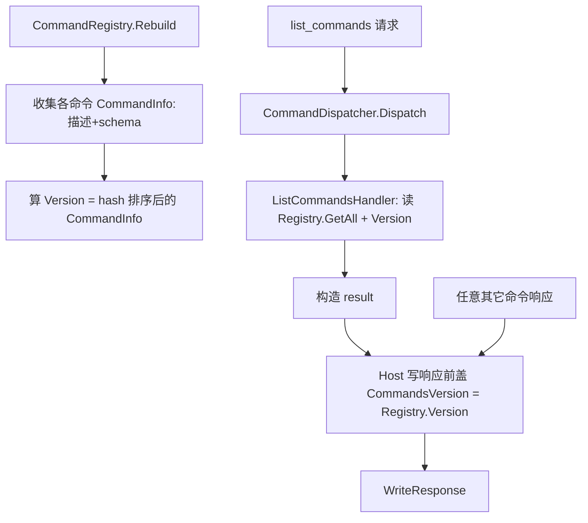

# cmd-introspection design

## 0. 术语约定

| 术语 | 定义 | 防冲突 |
|---|---|---|
| `list_commands` | 返回当前所有命令清单的内置元命令 | grep 代码无,全新 |
| `commandsVersion` | 命令集内容 hash,盖在每条响应上作缓存失效信号 | 全新字段 |
| `ICommandSchema` | handler 可选实现,暴露 params 的 JSON Schema | 全新接口 |
| `CommandInfo` | 单条命令的元数据 `{command, description, paramsSchema}` | 全新 |
| 自描述 | 命令携带描述(`[Command]` 特性)+ 可选参数 schema | — |

落地 decision `command-discovery-mechanism`。grep 防冲突:`list_commands` / `commandsVersion` / `ICommandSchema` 均未在代码出现。

## 1. 决策与约束

### 需求摘要
- **做什么**:让 AI 发现当前可用命令并感知命令集变化。三件事:① `list_commands` 元命令返回命令清单(名字+描述+参数 schema+version);② 每条响应盖 `commandsVersion`(内容 hash)作失效信号;③ handler 自描述(描述 + 可选 schema)。
- **为谁**:AI Agent(发现能力);后续所有命令 feature(按自描述契约带描述)。
- **成功标准**:调 `list_commands` 返回含 `ping` 与 `list_commands` 的清单,每条带 description,且 `result.commandsVersion` 非空;任意命令响应都带相同 `commandsVersion`;命令集变化后 version 变、不变则跨重启稳定。
- **明确不做**:
  - 不实现任何业务命令(本 feature 只新增 `list_commands`;`ping` 已存在)
  - 不写 CLAUDE.md 元知识内容(归 `agent-protocol-doc`)
  - 不做扩展安装/搜索(归 extension-manager)
  - 不强制 handler 提供 params schema(可选)

### 复杂度档位
走 Unity 编辑器工具默认档位,无偏离。

### 关键决策
- **D1 version 用确定性内容 hash**:对「排序后的 命令名+描述+schema」拼成规范串,用 `MD5`/`SHA` 算 hash 取短前缀。**禁止用 `string.GetHashCode()`**——.NET Core 下它跨进程随机化,version 会每次重启变,失效信号失真。换不稳定 hash → `commandsVersion` 语义崩坏,故属设计决策。
- **D2 盖戳单点**:由 `AgentBridgeHost` 在**写任何响应前**统一盖 `Response.CommandsVersion = CommandRegistry.Version`,覆盖正常/错误/INTERRUPTED 全路径。不在 `Response.MakeOk/MakeError` 工厂各自盖(会漏 error/孤儿路径)。
- **D3 自描述分两件**:description 走 `[Command(name, description)]` 特性(所有命令都能轻量加);params schema 走**可选** `ICommandSchema` 接口(按需实现)。不强制所有 handler 给 schema——保护「易扩展」。
- **D4 `list_commands` 是普通 `[Command]` handler**,走正常 dispatch,不做宿主特例——保持框架一致(它自己也出现在清单里)。
- **假设 A1 paramsSchema 自由形态**:用 `JObject` 承载,不强制符合某 JSON Schema 规范版本,handler 给什么是什么。后续可收紧。

### 前置依赖
bridge-core(done)。本 feature 追加修改其 Response/CommandAttribute/CommandRegistry/AgentBridgeHost/PingHandler,均向后兼容。

## 2. 名词与编排

### 2.1 名词层

**现状**(bridge-core 已有):
- `Response`(`Unity/Editor/Protocol/Response.cs`):字段 v/id/status/result/error/timestamp + `MakeOk`/`MakeError` 工厂。**无** commandsVersion。
- `CommandAttribute`(`Unity/Editor/Dispatch/CommandAttribute.cs`):`ctor(command)` + `Command`。**无** description。
- `CommandRegistry`(`Unity/Editor/Dispatch/CommandRegistry.cs`):`Handlers` 字典 + `Rebuild`/`TryGet`/`Commands`。**无** Version/hash、无描述/schema 存储。
- `AgentBridgeHost`(`Unity/Editor/Host/AgentBridgeHost.cs`):`Tick` 与 `ReclaimOrphans` 直接 `_channel.WriteResponse(resp)`。
- `ICommandHandler` / `PingHandler`:`PingHandler` 标 `[Command("ping")]`,无描述。

**变化**:

| 名词 | 动作 | 动机 |
|---|---|---|
| `Response.CommandsVersion` | 新增字段 `[JsonProperty("commandsVersion")]` | 4.1 契约失效信号 |
| `CommandAttribute` | 加 `description` 可选 ctor 参数 + `Description` 属性 | 4.3 自描述 |
| `ICommandSchema` | 新增可选接口 `JObject GetParamsSchema()` | 4.3 可选参数 schema |
| `CommandInfo` | 新增 `{Command, Description, ParamsSchema}` | list_commands 输出 + hash 输入 |
| `CommandRegistry` | Rebuild 时收集每命令 `CommandInfo`;新增 `Version`(hash)+ `GetAll()` | 4.3 / 4.7 |
| `ListCommandsHandler` | 新增 `[Command("list_commands", ...)]` | 4.7 发现入口 |
| `PingHandler` | 补 `[Command("ping", "连通性测试,返回 pong")]` | 遵守自描述契约 |
| `AgentBridgeHost` | 写响应前统一盖 `CommandsVersion`(单点) | D2 |

**接口示例**:
```jsonc
// list_commands 请求
{ "v":1, "id":"q1", "command":"list_commands", "params":{}, "timestamp":"..." }
// 响应 result
{ "commands": [
    { "command":"ping", "description":"连通性测试,返回 pong", "paramsSchema":null },
    { "command":"list_commands", "description":"列出所有可用命令", "paramsSchema":null }
  ],
  "commandsVersion": "a1b2c3d4" }
// 任意其它命令的响应也带 commandsVersion(顶层字段)
{ "v":1, "id":"p1", "status":"ok", "result":{...}, "error":null,
  "commandsVersion":"a1b2c3d4", "timestamp":"..." }
```
```csharp
public interface ICommandSchema { JObject GetParamsSchema(); }   // 来源:全新,Dispatch/
public struct CommandInfo { public string Command, Description; public JObject ParamsSchema; }
// CommandRegistry 新增:来源 Dispatch/CommandRegistry.cs
public static string Version { get; }              // 内容 hash
public static IEnumerable<CommandInfo> GetAll();   // 供 list_commands
```

### 2.2 编排层

**主流程图**(本 feature 主要是数据增补 + 一个新 handler,复用 bridge-core 主循环):


**现状**:`Tick`→`Dispatch`→`WriteResponse`;`Rebuild` 仅建名字→handler 索引。

**变化**:
- `Rebuild` 额外收集 `CommandInfo`(描述来自 `[Command]`,schema 来自 handler 若实现 `ICommandSchema`)并算 `Version`。
- `AgentBridgeHost` 在所有写响应处(`Tick` 正常路径 + `ReclaimOrphans` 孤儿路径)经**单一盖戳点**写入 `CommandsVersion`。
- `list_commands` 作为普通命令经现有 dispatch 流转,无新增编排分支。

**流程级约束**:
- `commandsVersion` 出现在**每条**响应(ok/error/INTERRUPTED),值统一为 `CommandRegistry.Version`。
- `Version` 为确定性内容 hash:排序消除顺序影响,同一命令集跨重启/换机恒定(D1)。
- 向后兼容:`commandsVersion` 为追加字段;`description` 缺省 null;`ICommandSchema` 不实现则 `paramsSchema=null`。bridge-core 的 `ping` 往返不受影响。
- `list_commands` 自身在清单中出现(它也是注册命令)。

### 2.3 挂载点清单

| 挂载位置 | 文件 | 动作 |
|---|---|---|
| `list_commands` 命令注册 | `Unity/Editor/Commands/ListCommandsHandler.cs`(`[Command("list_commands")]`) | 新增——删了它发现入口消失 |

其余为对 bridge-core 既有类型的**内部追加修改**(Response 加字段、Registry 加 Version/GetAll、Host 盖戳、CommandAttribute 加 description、PingHandler 补描述),属 implement 改动计划,不计挂载点。

### 2.4 推进策略
```
1. 自描述契约 + hash:CommandAttribute 加 description;新增 ICommandSchema;CommandRegistry
   Rebuild 收集 CommandInfo + 算确定性 Version(hash);新增 GetAll()
   退出:编译通过;同一命令集 Version 稳定、改命令集 Version 变(可写个临时断言或手测)
2. 响应盖版本:Response 加 CommandsVersion 字段;AgentBridgeHost 单点盖戳覆盖 Tick+ReclaimOrphans
   退出:任意命令响应里出现 commandsVersion
3. list_commands handler + PingHandler 补描述:ListCommandsHandler 读 GetAll()+Version 构造 result
   退出:调 list_commands 返回含 ping/list_commands 的清单 + commandsVersion
4. 端到端 + 边界:描述/schema 正确;version 随命令集变;向后兼容(无描述 handler 仍列出);ping 仍正常
   退出:第 3 节验收场景有可观察证据
```

### 2.5 结构健康度与微重构

##### 评估
- compound 检索(目录组织/命名/归属):仅 1 条 decision `command-discovery-mechanism`(内容决策,非目录 convention),无文件组织约束命中。
- 文件级(要改的):`Response.cs`(~50 行)、`CommandAttribute.cs`(~15 行)、`CommandRegistry.cs`(~80 行)、`AgentBridgeHost.cs`(~110 行)、`PingHandler.cs`(~20 行)——均健康、单一职责、改动点局部。
- 目录级(落新文件):`Dispatch/`(现 5 文件)+`ICommandSchema.cs`、`Commands/`(现 1 文件)+`ListCommandsHandler.cs`——均不拥挤。

##### 结论:不做(微重构)
要改文件都健康,新文件落进不挤的既有子目录,无重构必要。

##### 超出范围的观察
无。

## 3. 验收契约

### 关键场景清单
1. **list_commands 返回清单**:调 `list_commands` → `result.commands` 含 `{command:"ping",description:非空,...}` 与 `{command:"list_commands",...}`;`result.commandsVersion` 非空字符串。
2. **每条响应带 version**:任意命令(如 `ping`)响应顶层有 `commandsVersion`,值 = `list_commands` 返回的同值。
3. **可选 schema**:实现 `ICommandSchema` 的命令在清单里 `paramsSchema` 非 null;未实现的为 null(本 feature 内置命令可均为 null,机制以临时测试 handler 验证)。
4. **version 稳定性 + 敏感性**:命令集不变 → 重启编辑器后 `commandsVersion` 不变(同 hash);新增/删除一个命令或改其描述 → version 变。
5. **向后兼容**:无 description 的 handler(若有)仍出现在清单(description 为 null/空),不报错;bridge-core `ping` 往返照常 `status=ok`+`pong`。

### 明确不做的反向核对项
- 除 `list_commands` 外**不新增**业务命令(`CommandRegistry.GetAll()` 内置项仅 `ping`+`list_commands`)。
- `commandsVersion` 实现**不出现** `GetHashCode(`(grep 确认,改用 `MD5`/`SHA`)。
- 代码不写 CLAUDE.md 内容(本 feature 不碰 `agent-protocol-doc` 范围)。

## 4. 与项目级架构文档的关系

acceptance 阶段提炼回 `architecture/ARCHITECTURE.md`(第 4 节已有发现机制决策引用,需把现状坐实):
- **名词** → 第 2 节术语 + 第 3 节模块索引:`commandsVersion` 字段、`ICommandSchema`、`list_commands`。
- **流程级约束** → 第 5 节已知约束:每条响应盖确定性 hash 版本、自描述契约、命令 feature 必带描述。

关联:roadmap `file-bridge` 4.1/4.3/4.7(本 feature 实现);decision `command-discovery-mechanism`;requirement `agent-editor-control`。
