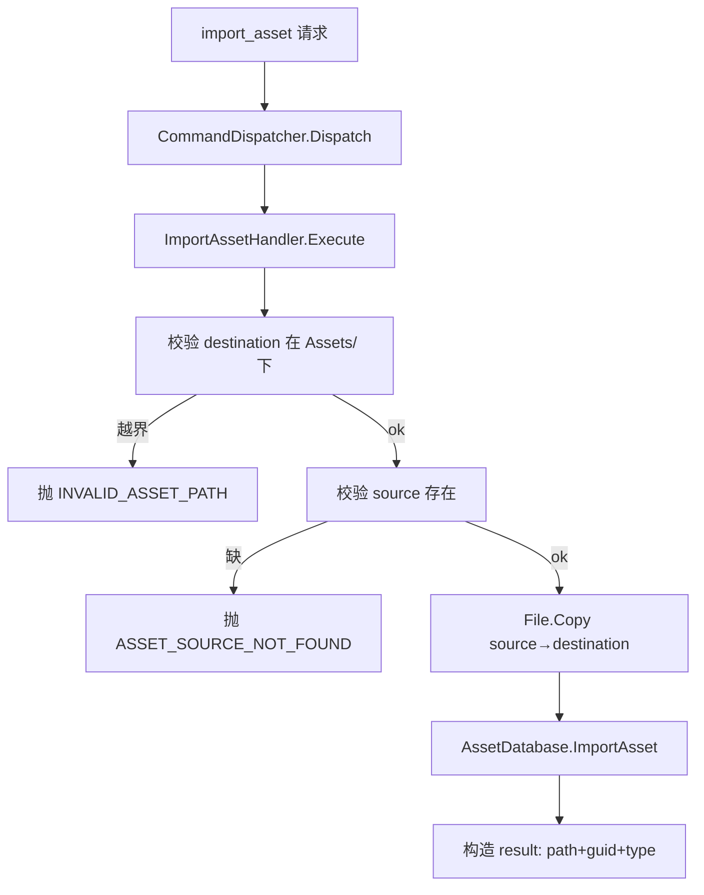

# cmd-assets design

## 0. 术语约定

| 术语 | 定义 | 防冲突 |
|---|---|---|
| `import_asset` | 把磁盘上的**外部文件**复制进工程并导入的命令 | 全新,grep 无 |
| `create_asset` | 在工程内创建资产(文件夹 / 文本文件 / ScriptableObject)的命令 | 全新 |
| `move_asset` | 工程内移动 / 重命名资产的命令 | 全新 |
| `delete_asset` | 把资产移入系统回收站的命令 | 全新 |
| `refresh` | 触发 `AssetDatabase.Refresh()` 重扫工程的命令 | 全新 |
| 工程相对路径 | 形如 `Assets/...` 的 AssetDatabase 路径(写操作只允许落在 `Assets/` 下) | — |
| `AssetErrorCodes` | 资源操作自有错误码(域内私有,放 `Commands/Assets/`) | 全新 |

grep 防冲突:`import_asset`/`create_asset`/`move_asset`/`delete_asset`/`refresh`/`AssetErrorCodes` 均未在代码出现。

## 1. 决策与约束

### 需求摘要
- **做什么**:给桥接加 5 个**资源操作**命令,让 AI 管理工程资产:
  - `import_asset` — 把外部磁盘文件弄进工程
  - `create_asset` — 建文件夹 / 文本文件 / ScriptableObject
  - `move_asset` — 移动 / 重命名
  - `delete_asset` — 删除(进回收站)
  - `refresh` — 重扫工程
- **为谁**:驱动桥接的 AI(落地资源级改动:引入下载的贴图、生成脚本/配置、整理目录)。
- **成功标准**:5 命令真机可调,正确改 AssetDatabase;写路径限 `Assets/` 下;删除可从回收站恢复;均出现在 `list_commands` 带描述+schema。
- **明确不做**:
  - 不动场景对象 / 组件属性(归 cmd-mutation)。
  - 不做 `execute_csharp`(归 cmd-csharp)。
  - 写路径**不允许**落在 `Assets/` 之外(不写工程外磁盘、不碰 `Packages/`、`ProjectSettings/`)。
  - 不做资产内容的深度编辑(如改材质参数——那是 set_property 在资产对象上的延伸,本期不涉及)。

### 复杂度档位
走默认档位,无偏离。

### 关键决策(均已与用户确认)
- **D1 import_asset = 导入外部文件进工程**:`params.source`(磁盘路径)+ `params.destination`(`Assets/` 下路径)→ `File.Copy` → `AssetDatabase.ImportAsset`。source 不存在 / destination 越界 → 错误码。
- **D2 create_asset 三种 kind**:`folder`(`AssetDatabase.CreateFolder`)/ `text`(`File.WriteAllText`+`ImportAsset`,建 .cs/.json/.txt 等)/ `scriptableObject`(按 `type` 名 `CreateInstance`+`CreateAsset`)。
- **D3 move_asset = 移动 / 重命名**:`AssetDatabase.MoveAsset(from, to)`(同一 API 兼顾改名);返回非空错误串 → `ASSET_MOVE_FAILED`。
- **D4 delete_asset = 移入回收站**:`AssetDatabase.MoveAssetToTrash`(可从系统回收站恢复)。资产操作不进 Ctrl-Z 撤销栈,回收站是唯一安全网。
- **D5 资产操作即时持久化(非 dirty-only)**:AssetDatabase 写操作直接落盘——与 cmd-mutation 的"标 dirty 不自动 save"**语义不同**(场景对象可延迟保存,资产 DB 改动是即时的)。create SO 后 `SaveAssets` 刷一次确保落盘。
- **D6 写路径守卫**:所有写目标路径必须工程相对、落在 `Assets/` 下;否则 `INVALID_ASSET_PATH`。import 的 source 可为任意磁盘路径(只读),destination 受此约束。
- **D7 5 命令均实现 `ICommandSchema`**(4.7)。
- **D8 自有错误码**(4.1 允许):`INVALID_ASSET_PATH`/`ASSET_SOURCE_NOT_FOUND`/`ASSET_NOT_FOUND`/`ASSET_CREATE_FAILED`/`ASSET_MOVE_FAILED`/`UNKNOWN_ASSET_TYPE`。

### 前置依赖
bridge-core + cmd-introspection(均 done)。与 cmd-inspection/cmd-mutation **无代码依赖**(不用对象引用层——资产以路径寻址,非 ObjectRef)。

## 2. 名词与编排

### 2.1 名词层

**现状**:
- handler 框架就绪;`Commands/` 下已有 `Inspection/`、`Mutation/` 两个按类别分的子目录(decision `commands-category-subdirectory`)。
- 无任何资源操作命令;无资产路径校验逻辑。

**变化**(全部新增,落 `Commands/Assets/`):

| 名词 | 角色 |
|---|---|
| `ImportAssetHandler` | `[Command("import_asset", …)]` + `ICommandSchema` |
| `CreateAssetHandler` | `[Command("create_asset", …)]` + `ICommandSchema` |
| `MoveAssetHandler` | `[Command("move_asset", …)]` + `ICommandSchema` |
| `DeleteAssetHandler` | `[Command("delete_asset", …)]` + `ICommandSchema` |
| `RefreshHandler` | `[Command("refresh", …)]` + `ICommandSchema` |
| `AssetErrorCodes` | 资源操作自有错误码(域内私有,放 `Commands/Assets/`) |

**接口示例**(输入→输出):
```jsonc
// import_asset —— 输入(把磁盘文件弄进工程)
{ "source": "C:/downloads/rock.png", "destination": "Assets/Art/rock.png" }
// 输出 result
{ "path": "Assets/Art/rock.png", "guid": "ab12...", "type": "UnityEngine.Texture2D" }

// create_asset folder —— { "kind":"folder", "path":"Assets/Art/Materials" } → { "path":"Assets/Art/Materials" }
// create_asset text   —— { "kind":"text", "path":"Assets/cfg.json", "content":"{}" } → { "path":..., "guid":... }
// create_asset SO     —— { "kind":"scriptableObject", "type":"MySettings", "path":"Assets/MySettings.asset" }
//                        → { "path":..., "guid":..., "type":"MySettings" };未知类型 → UNKNOWN_ASSET_TYPE

// move_asset   —— { "from":"Assets/a.png", "to":"Assets/Art/a.png" } → { "from":..., "to":... }
// delete_asset —— { "path":"Assets/old.png" } → { "deleted": true }   // 进回收站
// refresh      —— {} → { "refreshed": true }
```

### 2.2 编排层

**主流程图**(以 import_asset 为例;5 命令都经现有 dispatch,无宿主改动):


**现状**:dispatch 就绪;无资源命令;cmd-mutation 确立了"场景对象写=标 dirty 不 save",但资产是另一套持久化模型。

**变化**:新增 5 handler + `AssetErrorCodes`;**不改宿主/分发器/通道**;不复用对象引用层(资产按路径寻址)。

**流程级约束**:
- **写路径守卫**:写目标必须工程相对、`Assets/` 下;否则 `INVALID_ASSET_PATH`(import 的 source 例外,只读任意磁盘路径)。
- **即时持久化**:AssetDatabase 写直接落盘(非 dirty-only);create SO 后 `SaveAssets`。
- **不可 Ctrl-Z**:资产操作不进编辑器撤销栈;`delete_asset` 走回收站作为恢复手段。
- **主线程**:handler 在 update 回调内执行,直接用 `AssetDatabase`/`File`。
- **不碰场景/组件**:assets handler 不引用 `SceneObjectResolver`、不 `SetDirty`/`MarkSceneDirty`/`Undo`。
- **幂等性**:`refresh` 幂等;`move`/`delete` 第二次对同一路径 → `ASSET_MOVE_FAILED`/`ASSET_NOT_FOUND`;`create` 目标已存在由 AssetDatabase 行为决定(folder 已存在返回原 guid,text 覆盖写)。
- **自描述**:5 命令带 `[Command]` 描述 + `ICommandSchema`。

### 2.3 挂载点清单

| 挂载位置 | 文件 | 动作 |
|---|---|---|
| `import_asset` 命令注册 | `ImportAssetHandler`(`[Command]`) | 新增 |
| `create_asset` 命令注册 | `CreateAssetHandler` | 新增 |
| `move_asset` 命令注册 | `MoveAssetHandler` | 新增 |
| `delete_asset` 命令注册 | `DeleteAssetHandler` | 新增 |
| `refresh` 命令注册 | `RefreshHandler` | 新增 |

`AssetErrorCodes` 及路径守卫 / SO 类型解析为内部实现(非注册挂入点),归 implement 改动计划。

### 2.4 推进策略
```
1. 资源基础设施:AssetErrorCodes + 写路径守卫(限 Assets/ 下)+ SO 类型名解析(ScriptableObject 子类)
   退出:手测越界路径抛 INVALID_ASSET_PATH、未知 SO 类型抛 UNKNOWN_ASSET_TYPE
2. create_asset + delete_asset:folder/text/SO 三 kind 创建;MoveAssetToTrash 删除
   退出:真机建文件夹/文本/SO、删到回收站;无效 kind/类型报错
3. import_asset + move_asset:外部文件 File.Copy→ImportAsset;MoveAsset 移动/改名
   退出:真机导入外部文件、移动/改名;source 缺/移动失败报错
4. refresh:AssetDatabase.Refresh
   退出:真机调返回 refreshed:true
5. 自描述 + 端到端边界:5 handler 加描述 + ICommandSchema;list_commands 见 5 命令带 schema;
   边界(越界路径/source 缺/未知类型/移动失败/删不存在)
   退出:第 3 节验收场景有证据
```

### 2.5 结构健康度与微重构

##### 评估
- compound 检索(目录组织/命名):**命中** decision `commands-category-subdirectory`(convention)→ 直接照办:新建 `Commands/Assets/` 放 5 handler;域内私有的 `AssetErrorCodes` 也放该目录(非跨域共享,不进 `Editor/Scene/`)。
- 文件级(要改):全新增,无既有文件被实质改动。
- 目录级:`Commands/Assets/`(5 handler + AssetErrorCodes = 6 文件)新建;`Editor/Scene/` 不变(资产不用对象引用层)。均未超阈值。

##### 结论:不做(微重构)
全新增,直接遵守已归档的 `Commands/{Category}/` convention,目录不挤。

##### 超出范围的观察
- **类型名 → Type 解析重复**:`SceneObjectResolver.FindType` 限定 `Component` 子类;本 feature 的 `create_asset` SO 需解析 `ScriptableObject` 子类,会写一份并行的类型解析。两处逻辑相似但基类过滤不同。建议后续走 `cs-refactor` 抽一个通用 `TypeResolver`(按基类过滤),把 `FindType` 收敛进去。**不阻塞本 feature**——本期 assets 先自带最小 SO 解析。

## 3. 验收契约

### 关键场景清单
1. **import_asset**:磁盘外部文件 → 复制进 `Assets/` 下 + 导入,返回 `path+guid+type`;source 不存在 → `ASSET_SOURCE_NOT_FOUND`;destination 不在 `Assets/` 下 → `INVALID_ASSET_PATH`。
2. **create_asset folder**:`kind=folder` + path → 文件夹建出。
3. **create_asset text**:`kind=text` + path + content → 文本/源码文件写出 + 导入,返回 `path+guid`。
4. **create_asset SO**:`kind=scriptableObject` + type + path → SO 资产创建;未知类型 → `UNKNOWN_ASSET_TYPE`。
5. **move_asset**:from→to 移动 / 改名成功;非法目标 → `ASSET_MOVE_FAILED`。
6. **delete_asset**:path → 移入回收站(`deleted:true`);不存在 → `ASSET_NOT_FOUND`。
7. **refresh**:→ `refreshed:true`。
8. **写路径守卫**:任一写命令目标在 `Assets/` 外(如 `C:/x` 或 `Packages/...`)→ `INVALID_ASSET_PATH`。
9. **自描述**:`list_commands` 显示 5 个新命令,各 `description` 非空、`paramsSchema` 非 null。
10. **持久化语义**:资产操作即时落盘(调用后磁盘/AssetDatabase 立即可见,无需额外 save)——与场景 mutation 的 dirty-only 区分。

### 明确不做的反向核对项
- 代码**不碰场景/组件**:assets handler grep 无 `SceneObjectResolver`/`SetDirty`/`MarkSceneDirty`/`Undo.`。
- 写路径**限 Assets/ 下**:每个写命令前有路径守卫(grep 守卫调用 5 处)。
- 仅注册 `import_asset`/`create_asset`/`move_asset`/`delete_asset`/`refresh` 五命令(不混入场景写/读/csharp 命令)。
- 5 命令都带 `[Command]` 描述。
- `delete_asset` 用 `MoveAssetToTrash` 而非 `DeleteAsset`(grep 无 `AssetDatabase.DeleteAsset`)。

## 4. 与项目级架构文档的关系

acceptance 提炼回 `architecture/ARCHITECTURE.md`:
- **名词**:5 个资源命令 → M5 命令列表;`AssetErrorCodes`(域内私有)。
- **流程级约束**:资产操作即时持久化(非 dirty-only)、写路径限 `Assets/` 下、删除走回收站、不可 Ctrl-Z → 已知约束。
- **convention 落地**:首个消费 `commands-category-subdirectory`(`Commands/Assets/`)的 feature,可在 §3 M5 体现命令域目录化已成型。

关联:roadmap `file-bridge` 4.1/4.7;requirement `agent-editor-control`;decision `commands-category-subdirectory`、`command-discovery-mechanism`。
