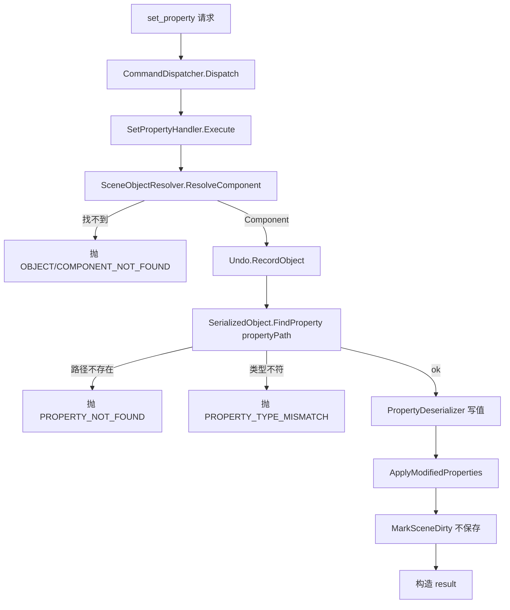

# cmd-mutation design

## 0. 术语约定

| 术语 | 定义 | 防冲突 |
|---|---|---|
| `set_property` | 写组件某属性的命令 | 全新,grep 无 |
| `invoke_menu` | 执行编辑器菜单项的命令(逃生舱) | 全新 |
| `create_object` | 创建 GameObject(空/图元/prefab 实例)的命令 | 全新 |
| `delete_object` | 删除 GameObject 的命令 | 全新 |
| propertyPath | Unity `SerializedProperty` 的路径串,支持嵌套(如 `m_LocalPosition.x`) | Unity 既有概念 |
| `PropertyDeserializer` | JSON 值 → `SerializedProperty` 写值(`PropertySerializer` 的对偶,共享) | 全新 |
| 标记 dirty | `EditorSceneManager.MarkSceneDirty` / `EditorUtility.SetDirty`,标脏待存,**不**触发保存 | — |

grep 防冲突:`set_property`/`invoke_menu`/`create_object`/`delete_object`/`PropertyDeserializer` 均未在代码出现。复用 cmd-inspection 已落地的 `ObjectRef`/`ComponentRef`/`SceneObjectResolver`/`PropertySerializer`/`RefErrorCodes`。

## 1. 决策与约束

### 需求摘要
- **做什么**:给桥接加 4 个**写**命令,让 AI 改 Unity 编辑器状态:
  - `set_property` — 改某组件的属性(支持嵌套路径)
  - `invoke_menu` — 执行编辑器菜单项(逃生舱)
  - `create_object` — 创建 GameObject(空 / 图元 / 实例化 prefab)
  - `delete_object` — 删除 GameObject
- **为谁**:驱动桥接的 AI(读现场后落地改动)。
- **成功标准**:4 命令真机可调,正确改场景;改动**置 dirty 待存**且可在编辑器 **Ctrl-Z 撤销**;均出现在 `list_commands` 带描述+schema;不自动保存(set/create/delete 路径)。
- **明确不做**:
  - 不做资源级操作(import/create/move/delete **asset** 归 cmd-assets);`create_object` 的 prefab 实例化是"用资源建场景对象",`delete_object` 只删场景对象,均**不动资源本身**。
  - 不自动保存场景/资源(只标 dirty)。
  - 不做 `execute_csharp`(归 cmd-csharp)。
  - 不做 Play mode / 运行时。

### 复杂度档位
走默认档位,无偏离。

### 关键决策(均已与用户确认)
- **D1 记录 Undo**:`set_property` 用 `Undo.RecordObject`、`create_object` 用 `Undo.RegisterCreatedObjectUndo`、`delete_object` 用 `Undo.DestroyObjectImmediate`。AI 改错人能一键撤销,安全网。
- **D2 仅标记 dirty 不自动保存**:写完 `MarkSceneDirty`/`SetDirty`,何时落盘交用户。`invoke_menu` 例外——其行为完全取决于被调菜单项,可能含保存,不在桥接控制内(逃生舱定位)。
- **D3 set_property 支持嵌套路径**:`SerializedObject.FindProperty(propertyPath)`,与 `get_object` 顶层读取互补;按 `propertyType` 写值,类型不符抛错。
- **D4 create_object 三种 kind**:`empty`(空 GameObject)/`primitive`(Cube/Sphere… 经 `ObjectFactory`)/`prefab`(按资源路径 `PrefabUtility.InstantiatePrefab`)。可选 `name`/`parent`(ObjectRef)。
- **D5 复用 cmd-inspection 基础设施**:对象/组件解析走 `SceneObjectResolver.ResolveObject/ResolveComponent/FindType`,不另写;引用类型属性的值解析与 `PropertySerializer` 渲染对偶。
- **D6 新增 handler 自有错误码**(4.1 允许):`PROPERTY_NOT_FOUND`/`PROPERTY_TYPE_MISMATCH`/`MENU_NOT_FOUND`/`CREATE_FAILED`;复用 `RefErrorCodes` 的 `OBJECT_NOT_FOUND`/`COMPONENT_NOT_FOUND`/`INVALID_OBJECT_REF`。
- **D7 4 命令均实现 `ICommandSchema`**(4.7 硬约束)。

### 前置依赖
bridge-core + cmd-inspection(均 done;复用其对象引用方案)。传递依赖 cmd-introspection。

## 2. 名词与编排

### 2.1 名词层

**现状**:
- handler 框架(`ICommandHandler`/`[Command]`/`ICommandSchema`/`CommandDispatcher`)就绪。
- cmd-inspection 已落地共享层 `Editor/Scene/`:`ObjectRef`/`ComponentRef`/`SceneObjectResolver`(`ResolveObject`/`ResolveComponent`/`FindType`/`GetPath`)/`PropertySerializer`/`RefErrorCodes`——本 feature 直接复用,**只读不改**。

**变化**(全部新增):

| 名词 | 角色 |
|---|---|
| `SetPropertyHandler` | `[Command("set_property", …)]` + `ICommandSchema` |
| `InvokeMenuHandler` | `[Command("invoke_menu", …)]` + `ICommandSchema` |
| `CreateObjectHandler` | `[Command("create_object", …)]` + `ICommandSchema` |
| `DeleteObjectHandler` | `[Command("delete_object", …)]` + `ICommandSchema` |
| `PropertyDeserializer` | JSON 值 → `SerializedProperty`(基本类型/向量/颜色/枚举/对象引用);`PropertySerializer` 对偶,共享放 `Editor/Scene/` |
| `MutationErrorCodes` | 写操作自有错误码常量(与 `RefErrorCodes` 并列) |

**接口示例**(输入→输出):
```jsonc
// set_property —— 输入(改 Transform 的 x)
{ "component": { "object": {"path":"Player"}, "type":"Transform", "index":0 },
  "propertyPath": "m_LocalPosition.x", "value": 3.5 }
// 输出 result
{ "object": {"name":"Player","path":"Player","instanceId":111},
  "component": "UnityEngine.Transform", "propertyPath":"m_LocalPosition.x", "applied": true }

// create_object —— 输入(在 Player 下建一个 Cube)
{ "kind":"primitive", "primitive":"Cube", "name":"Crate", "parent": {"path":"Player"} }
// 输出 result —— 返回新对象 ObjectRef(供后续命令引用)
{ "object": {"name":"Crate","path":"Player/Crate","instanceId":222,"active":true} }

// delete_object —— 输入 { "object": {"instanceId":222} } → 输出 { "deleted": true }

// invoke_menu —— 输入 { "path":"GameObject/Align With View" } → 输出 { "executed": true }
```

### 2.2 编排层

**主流程图**(以 set_property 为例;4 命令都经现有 dispatch,无宿主改动):


**现状**:dispatch 循环就绪;无写命令;cmd-inspection 确立了"只读不置 dirty"约束。

**变化**:新增 4 handler + `PropertyDeserializer`;**不改宿主/分发器/通道**(只挂新命令);相对 inspection,只读约束在 mutation 范围**反转为"必须置 dirty"**(但仍不自动 save)。

**流程级约束**:
- **写语义**:set/create/delete 改完一律标 dirty(`MarkSceneDirty` 对场景对象、`SetDirty` 对组件);**不自动 save**。
- **可撤销**:每条写命令记录 Undo(D1),一命令一 Undo 组(可命名,如 `"AgentBridge set_property"`)。
- **主线程**:handler 在 update 回调内执行,直接用 Unity API。
- **对象引用复用**:解析走 `SceneObjectResolver`;失败语义沿用 `RefErrorCodes`(`INVALID_OBJECT_REF`/`OBJECT_NOT_FOUND`/`COMPONENT_NOT_FOUND`)。
- **幂等性**:`set_property` 幂等(同值重复写结果一致);`create_object` 非幂等(每次新建);`delete_object` 第二次删同一对象 → `OBJECT_NOT_FOUND`。
- **自描述**:4 命令带 `[Command]` 描述 + `ICommandSchema`。
- **逃生舱边界**:`invoke_menu` 仅转发 `EditorApplication.ExecuteMenuItem`,副作用(含可能的保存/资源改动)由被调菜单项决定,不在桥接 dirty/save 纪律约束内。

### 2.3 挂载点清单

| 挂载位置 | 文件 | 动作 |
|---|---|---|
| `set_property` 命令注册 | `SetPropertyHandler`(`[Command]`) | 新增 |
| `invoke_menu` 命令注册 | `InvokeMenuHandler` | 新增 |
| `create_object` 命令注册 | `CreateObjectHandler` | 新增 |
| `delete_object` 命令注册 | `DeleteObjectHandler` | 新增 |

`PropertyDeserializer`/`MutationErrorCodes` 为内部共享基础设施(非注册挂入点),归 implement 改动计划。复用的 inspection 基础设施不在本清单(非本 feature 引入)。

### 2.4 推进策略
```
1. 写值基础设施:PropertyDeserializer(JSON→SerializedProperty 类型映射 + objectReference 解析)+ MutationErrorCodes
   退出:手测写 Transform 某属性成功、类型不符抛 PROPERTY_TYPE_MISMATCH
2. set_property:ResolveComponent → Undo.RecordObject → FindProperty(嵌套路径)→ 写值 → Apply → MarkSceneDirty
   退出:真机改组件属性、场景变 dirty、Ctrl-Z 可撤销
3. create_object + delete_object:空/图元/prefab 创建(RegisterCreatedObjectUndo)、删除(DestroyObjectImmediate undo 版)
   退出:真机建/删对象、dirty、可撤销;prefab 无效路径 → CREATE_FAILED
4. invoke_menu:ExecuteMenuItem → bool;false → MENU_NOT_FOUND
   退出:真机执行已知菜单项成功、未知项报错
5. 自描述 + 端到端边界:4 handler 加描述 + ICommandSchema;list_commands 见 4 命令带 schema;
   边界(not found / 类型不符 / 菜单失败 / prefab 路径无效)
   退出:第 3 节验收场景有证据
```

### 2.5 结构健康度与微重构

##### 评估
- compound 检索(目录组织/命名):无文件组织 convention 命中(仅 command-discovery decision)。
- 文件级(要改):本 feature 全新增;复用的 inspection 共享层**只读不改**,无既有文件被实质改动。
- 目录级:`Commands/` 现有 ping/list_commands(2)+ `Inspection/`(4)+ 新增 `Mutation/`(4 handler);`Editor/Scene/` 现 5 文件 → 加 `PropertyDeserializer`(+ 可能 `MutationErrorCodes`)= 6~7 文件。均未超阈值(<8)。

##### 结论:不做(微重构)
全新增,沿用 cmd-inspection 已确立的"`Commands/{类别}/` 一类命令一子目录 + `Editor/Scene/` 放共享对象基础设施"布局,目录不挤。

##### 建议沉淀的 convention(implement 跑通后提示 cs-decide)
`Commands/{Category}/`(Inspection、Mutation……)按命令类别分子目录,本 feature 是该模式**第二次**出现(inspection 验收时记为"才 6 文件言之过早")。两次一致即显现为稳定布局约定 → implement 跑通后建议走 `cs-decide` 归档为 convention(后续 cmd-assets/cmd-csharp 都应遵守)。本阶段不归档。

##### 超出范围的观察
无。

## 3. 验收契约

### 关键场景清单
1. **set_property 基本**:改 `Transform` 的 `m_LocalPosition.x`(嵌套路径)→ 对象位置变;场景置 dirty;Ctrl-Z 撤销恢复原值。
2. **set_property 引用类型**:把某 `ObjectReference` 字段设为资源(assetPath)或场景对象(ObjectRef)→ 引用正确挂上(与 `PropertySerializer` 渲染对偶)。
3. **create_object empty**:`kind=empty` + name + parent → 新空对象挂在 parent 下,返回其 ObjectRef;dirty;可撤销。
4. **create_object primitive**:`kind=primitive` `primitive=Cube` → 新 Cube 进当前/parent 场景。
5. **create_object prefab**:`prefabPath` 有效 → 实例化为场景对象;无效路径 → `CREATE_FAILED`。
6. **delete_object**:resolve → 删除;dirty;可撤销;**第二次**删同一对象 → `OBJECT_NOT_FOUND`。
7. **invoke_menu**:已知菜单项 → `ExecuteMenuItem` 返回 true(`executed:true`);未知/失败 → `MENU_NOT_FOUND`。
8. **错误路径**:`ComponentRef` 类型不在该对象 → `COMPONENT_NOT_FOUND`;`propertyPath` 不存在 → `PROPERTY_NOT_FOUND`;`value` 与属性类型不符 → `PROPERTY_TYPE_MISMATCH`;ObjectRef 缺 path/id → `INVALID_OBJECT_REF`。
9. **自描述**:`list_commands` 显示 4 个新命令,各 `description` 非空、`paramsSchema` 非 null。
10. **写副作用正确**:set/create/delete 调用后目标场景**被标记 dirty**(与 inspection 相反);但**未自动保存**。

### 明确不做的反向核对项
- 代码**不出现**资源级写 API:set/create/delete 路径 grep 无 `AssetDatabase.CreateAsset`/`ImportAsset`/`MoveAsset`/`DeleteAsset`(资源操作归 cmd-assets)。
- 代码**不自动保存**:set/create/delete 路径 grep 无 `EditorSceneManager.SaveScene`/`AssetDatabase.SaveAssets`(`invoke_menu` 不在此约束,被调菜单项自负)。
- 仅注册 `set_property`/`invoke_menu`/`create_object`/`delete_object` 四写命令(不混入读/资源/csharp 命令)。
- 4 命令都带 `[Command]` 描述(grep 4 处 `[Command("` 均含第二参数)。
- 复用 inspection 基础设施而非另写解析:grep 无重复的 `FindByPath`/`ResolveObject` 实现(仅 SceneObjectResolver 一处)。

## 4. 与项目级架构文档的关系

acceptance 提炼回 `architecture/ARCHITECTURE.md`:
- **名词**:4 个写命令 → M5 命令列表(读已列,补写);`PropertyDeserializer` → `Editor/Scene/` 共享层补充。
- **流程级约束**:写语义(置 dirty 不自动 save)、Undo 记录、`invoke_menu` 逃生舱边界 → 已知约束。
- **可能的 convention**:`Commands/{Category}/` 子目录布局(若 implement 后经 cs-decide 归档)。

关联:roadmap `file-bridge` 4.1/4.5/4.7;requirement `agent-editor-control`;复用 feature `cmd-inspection`;decision `command-discovery-mechanism`。
