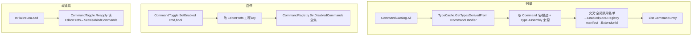

# command-catalog design

## 0. 术语约定

| 术语 | 定义 | 防冲突 |
|---|---|---|
| `CommandCatalog` | 列所有命令(内置+扩展)的目录 API:`All()` | 全新 |
| `CommandEntry` | 一条命令的统一条目:Name/Description/Assembly/IsBuiltin/ExtensionId/Enabled | 全新 |
| `CommandToggle` | 全局启停 API:`SetEnabled(command,bool)`/`Reapply()` | 全新 |
| 全局禁用名单 | EditorPrefs(工程标识 key)存的、跨内置+扩展的单一禁用命令名集合 | 取代 per-ext meta |
| 来源(Assembly) | `Type.Assembly` 名;`AgentBridge.Editor`=内置,其它=扩展 | — |

grep:`CommandCatalog`/`CommandEntry`/`CommandToggle` 均未在代码出现。

## 1. 决策与约束

### 需求摘要
- **做什么**:命令管理器完整落地——① `TypeCache` 列出所有命令(内置+扩展)+ 来源 + 启停态;② 全局禁用名单持久化(任意命令可禁,含内置),domain reload 后重应用;③ **重写命令管理器窗口**(按来源分组列所有命令 + 逐命令启停 + 扩展卸载)。**合并了原 command-manager-window**(实现时发现引擎切换与窗口改写耦合,见下文)。
- **为谁**:用桥接的开发者(在窗口里浏览/启停所有命令);domain reload 重应用机制。
- **成功标准**:`CommandCatalog.All()` 返回所有命令(名/描述/来源/扩展归属/启停态);`CommandToggle.SetEnabled(cmd,false)` 把命令写入全局名单 → 经 file-bridge 在 `list_commands` 隐藏、dispatch 拒调;状态存 `disabled-commands.json`,domain reload 后 `Reapply` 重建。
- **明确不做**:
  - 不改 file-bridge 禁用过滤本身(`CommandRegistry.SetDisabledCommands`/`IsDisabled`/`COMMAND_DISABLED` 已由 ext-enable-disable 落地,**复用不改**)。
  - 不做远程/安装(扩展由用户自放;卸载复用 ext-core 既有 `Uninstall`,不新写)。
  - 不做比命令更细粒度。
  - 不动 `InstalledMeta` 文件模型本身(只去其启停字段;meta 是否整体废弃留后续 cs-refactor)。

### 复杂度档位
走默认档位。

### 关键决策
- **D1 发现用 TypeCache**:`TypeCache.GetTypesDerivedFrom<ICommandHandler>()` 列所有 handler 类型;每类型取 `[Command]` 名/描述、`Type.Assembly.GetName().Name` 来源。**不经 CommandRegistry.GetAll()**——后者已按可见集过滤(禁用的不返回),目录需要含**禁用的**命令(才能在窗口里再启用)。
- **D2 全局禁用名单取代 per-ext meta,存 EditorPrefs**:启停真相源改为 **EditorPrefs**,key 带工程标识(`"AgentBridge.DisabledCommands." + Application.dataPath`)避免跨工程串(EditorPrefs 是按 Unity 安装共享的);值为命令名分隔串。**废弃** ext-enable-disable 的 `ExtensionState`(per-ext meta 读写)+ `InstalledMeta.enabled/disabledCommands` 作为启停源。
- **D3 复用 file-bridge 过滤**:`CommandToggle.Reapply()` 读全局名单 → `CommandRegistry.SetDisabledCommands(names)`。file-bridge 侧零改动。
- **D4 扩展归属复用 LocalRegistry**:命令名 ∈ 某扩展 `manifest.commands` → 该 `ExtensionId`;否则内置(AgentBridge.Editor)或"其它"。
- **D5 域重载重应用**:`[InitializeOnLoad]` 调 `CommandToggle.Reapply()`(替换 ext-enable-disable 的 `ExtensionStateBootstrap`)。
- **D6 schema 不进目录**:`CommandEntry` 不带 paramsSchema(窗口管理不需要;AI 要 schema 走 `list_commands`)。
- **D7 窗口重写(合并 command-manager-window)**:`ExtensionManagerWindow` 重写为命令浏览器——`CommandCatalog.All()` 按来源(内置/各扩展/其它)分组列出,每命令 Enable/Disable 调 `CommandToggle`,扩展分组项 Uninstall 调 ext-core `ExtensionInstaller.Uninstall`。并入 ext-manager-ui 的打磨(概览头/状态过滤/ScrollView)。**原因**:删 `ExtensionState` 会断窗口编译,且新旧禁用引擎不能共存——引擎切换与窗口改写必须同 feature 落地(用户已确认合并)。

### 前置依赖
ext-core(LocalRegistry/manifest 复用)+ ext-enable-disable(file-bridge 禁用过滤复用;其 meta 持久化本feature 替换)。均 done。

## 2. 名词与编排

### 2.1 名词层

**现状**:
- file-bridge `CommandRegistry`:有 `SetDisabledCommands`/`IsDisabled`、`GetAll()`(可见集)、反射注册全部命令。
- ext-enable-disable:`ExtensionState`(读写 per-ext `meta.enabled/disabledCommands` + 算并集 + 推 file-bridge)、`ExtensionStateBootstrap`([InitializeOnLoad]→Reapply)。**启停真相源在各扩展 meta。**
- ext-core:`LocalRegistry.Scan()`(读 manifest+meta → InstalledExtension)、`ExtensionInstaller`、`InstalledMeta`(含 enabled/disabledCommands)。

**变化**:

| 名词 | 角色 | 动作 |
|---|---|---|
| `CommandEntry` | 命令统一条目 DTO | 新增 `Extensions/` |
| `CommandCatalog` | `All()`:TypeCache 列举 + 来源 + 扩展归属 + 启停态 | 新增 |
| `CommandToggle` | `SetEnabled(cmd,bool)`/`Reapply()`,操作全局名单 | 新增 |
| 全局禁用名单存储 | 读写 EditorPrefs(工程标识 key) | 新增(可并入 CommandToggle) |
| `ExtensionState` | per-ext meta 启停 | **删除**(被 CommandToggle 取代) |
| `ExtensionStateBootstrap` | 域重载钩子 | **改**:调 `CommandToggle.Reapply()`(或删旧建新) |
| `InstalledMeta.enabled/disabledCommands` | 启停字段 | **作废**(meta 不再驱动启停;字段可留作惰性元信息或一并清,见 2.5) |
| `InstalledExtension.Enabled/DisabledCommands` | 扫描出的启停字段 | **作废**(LocalRegistry 归属只需 id+commands) |

**接口示例**:
```jsonc
// CommandCatalog.All() →
[ { "Name":"ping","Description":"连通性测试…","Assembly":"AgentBridge.Editor","IsBuiltin":true,"ExtensionId":null,"Enabled":true },
  { "Name":"do_thing","Description":"…","Assembly":"MyExt.Editor","IsBuiltin":false,"ExtensionId":"my-ext","Enabled":false } ]

// CommandToggle.SetEnabled("ping", false)
//  → EditorPrefs(工程key) += "ping" → CommandRegistry.SetDisabledCommands(全集)
//  → list_commands 不再含 ping、commandsVersion 变、dispatch ping → COMMAND_DISABLED

// domain reload → [InitializeOnLoad] → CommandToggle.Reapply() 读 EditorPrefs 重建禁用名单
```

### 2.2 编排层



**现状 → 变化**:ext-enable-disable 把"禁用名单"从 per-ext meta 算出;本 feature 改为从**单一全局 json** 算出,并把"命令清单"来源从"扫描扩展文件夹"升级为"TypeCache 全量"。file-bridge 过滤、LocalRegistry 扫描、Uninstall **不动**。

**流程级约束**:
- **目录含禁用项**:`CommandCatalog.All()` 用 TypeCache(非 CommandRegistry.GetAll 的可见集),保证禁用的命令也在目录里(否则窗口无法再启用)。
- **单一真相源**:启停态 = 全局 EditorPrefs 名单;`Enabled` 字段是它的派生。`Reapply` 幂等。
- **复用不改 file-bridge**:只调 `SetDisabledCommands`,不碰其过滤/错误码。
- **域重载重应用**:`[InitializeOnLoad]`→`Reapply`(与 ext-enable-disable 同机制,换数据源)。
- **来源稳定**:内置 = `AgentBridge.Editor`;扩展须自带 asmdef,其 assembly 即来源;无 asmdef 的 loose 扩展命令 `ExtensionId=null`(落"其它")。

### 2.3 挂载点清单

| 挂载位置 | 文件 | 动作 |
|---|---|---|
| 命令目录 API | `CommandCatalog` | 新增 |
| 全局启停 API + 存储 | `CommandToggle`(+ 存储) | 新增 |
| 域重载重应用 | `[InitializeOnLoad]` 钩子 | 改(指向 CommandToggle.Reapply) |
| 旧 per-ext 启停 | `ExtensionState` | 删除 |
| 命令管理器窗口 | `ExtensionManagerWindow` | 重写(命令浏览器,合并 command-manager-window)|

**拔除**:删 CommandCatalog/CommandToggle/存储/bootstrap → 命令管理数据层消失(file-bridge 过滤仍在但无人喂禁用名单 → 全可见)。

### 2.4 推进策略
```
1. 全局禁用名单 + 启停:CommandToggle(读写 disabled-commands.json + SetEnabled + Reapply→CommandRegistry.SetDisabledCommands);[InitializeOnLoad] 指向它;删 ExtensionState(per-ext meta)+旧 Bootstrap
   退出:SetEnabled 写 json 并经 file-bridge 生效;Reapply 从 json 重建;旧 ExtensionState 已移除无残留引用
2. 命令目录:CommandEntry + CommandCatalog.All(TypeCache 列举 + 来源 + LocalRegistry 归属 + 交叉禁用名单)
   退出:All() 返回所有命令(内置+扩展)含禁用项,Enabled/ExtensionId/IsBuiltin 正确
3. 重写命令管理器窗口:ExtensionManagerWindow 改为 CommandCatalog.All() 按来源分组 + 逐命令 CommandToggle 启停 + 扩展项 Uninstall;并入概览/过滤/ScrollView(**先于字段清理**——窗口先停用 ext.Enabled,再删字段才不断编译)
   退出:窗口列出所有命令(内置+扩展)按来源分组、逐命令启停经 file-bridge 生效、扩展项可卸载;不再引用 ExtensionState/ext.Enabled
4. 清理 ext-enable-disable 作废字段:InstalledMeta/InstalledExtension 去掉 enabled/disabledCommands(LocalRegistry 归属只留 id+commands);确认无引用残留
   退出:grep 无 meta 启停字段引用;LocalRegistry 仅供归属
```

### 2.5 结构健康度与微重构

##### 评估
- compound:无目录 convention 命中(扩展层非 Commands/)。
- 文件级:删 `ExtensionState.cs`;改 `ExtensionStateBootstrap.cs`(指向 CommandToggle);改 `InstalledMeta.cs`/`InstalledExtension.cs`/`LocalRegistry.cs`(去启停字段);新增 `CommandCatalog.cs`/`CommandEntry.cs`/`CommandToggle.cs`。均小幅。
- 目录级:`Extensions/` 现 8 文件,净增 ~1-2(删 1 增 3 改几个)→ ~10。单模块合理。

##### 结论:不做(独立微重构步)
返工是本 feature 的题中之义(roadmap 已定),不另立微重构步;删除/改字段随对应 step 完成。

##### 超出范围的观察
- `InstalledMeta` 失去 enabled/disabledCommands 后只剩 id/version/sourceRepo/commit/installedAt——是否还需要 meta 文件(纯本地无人写它了)?**本 feature 先留模型**(LocalRegistry 读 manifest 即可,meta 可选);若确认 meta 完全无用,后续单独 cs-refactor 删。不阻塞。

## 3. 验收契约

### 关键场景清单
1. **目录列全**:`CommandCatalog.All()` 返回**所有**命令(内置 15 + 任何扩展),含**已禁用**的;每条 Name/Description/Assembly/IsBuiltin 正确。
2. **来源区分**:内置命令 `IsBuiltin=true`/`Assembly=AgentBridge.Editor`/`ExtensionId=null`;扩展命令 `IsBuiltin=false` + `ExtensionId`(命令∈manifest.commands 时)。
3. **禁用生效**:`SetEnabled(cmd,false)` → EditorPrefs 名单含该命令 → `list_commands` 不含、`commandsVersion` 变、dispatch 返 `COMMAND_DISABLED`;`All()` 里该条 `Enabled=false`。
4. **启用恢复**:`SetEnabled(cmd,true)` → 移出名单 → 命令重现、可调、`Enabled=true`。
5. **内置可禁**:对内置命令(如 `ping`)`SetEnabled(false)` 同样生效(验证全局名单覆盖内置)。
6. **持久+重应用**:禁用后 domain reload → `Reapply` 从 json 重建 → 仍禁用。
7. **旧模型已退场**:`ExtensionState`(per-ext meta 启停)已删;启停不再读写 `meta.enabled/disabledCommands`;窗口不再引用 `ExtensionState`/`ext.Enabled`。
8. **窗口=命令浏览器**:窗口按来源(内置/各扩展/其它)分组列出 `CommandCatalog.All()` 的所有命令;逐命令 Enable/Disable 经 `CommandToggle` 生效;扩展分组项 Uninstall 删目录。
9. **内置也在窗口**:内置命令(如 ping)出现在窗口"内置"组,可在窗口里禁用/启用。

### 明确不做的反向核对项
- 不改 file-bridge 过滤:`CommandRegistry`/`CommandDispatcher`/`ErrorCodes` 无改动(仅调用 `SetDisabledCommands`)。
- 启停不再依赖 per-ext meta:grep 启停路径无 `meta.enabled`/`meta.disabledCommands` 读写;`ExtensionState` 文件已删。
- 不新写卸载/远程/安装:卸载复用 ext-core `ExtensionInstaller.Uninstall`(grep 窗口无新卸载实现)。
- 不动 `InstalledMeta` 文件模型本身(只去启停字段)。

## 4. 与项目级架构文档的关系

acceptance 提炼回 `architecture/ARCHITECTURE.md`:
- 扩展子系统小节重写:从"扩展启停(per-ext meta)"改为"命令目录(TypeCache)+ 全局禁用名单(disabled-commands.json)";`ExtensionState` 退场、`CommandCatalog`/`CommandToggle` 登场。
- §5 约束:启停真相源 = 全局 `disabled-commands.json`(覆盖内置+扩展);命令发现 = TypeCache。
- requirement `extension-management`:本 feature 含窗口落地,acceptance 时按"命令管理器"视角刷新 req(原"扩展管理"视角过时)。
- **本 feature 合并了 command-manager-window**:acceptance 回写 roadmap 时,command-manager-window 条目标 dropped(absorbed)。

关联:roadmap `extension-manager` §4.1/4.2/4.3;复用 file-bridge `command-discovery-mechanism` + ext-enable-disable 禁用过滤;复用 ext-core LocalRegistry。
