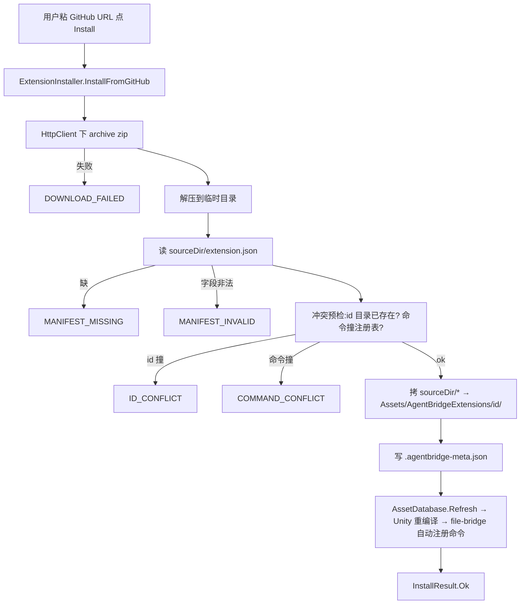

# ext-core design

## 0. 术语约定

| 术语 | 定义 | 防冲突 |
|---|---|---|
| 扩展(extension) | 一包命令 handler 源码 + `extension.json` 清单,装进宿主工程 Assets/ 后由 file-bridge 自动注册 | 全新概念 |
| `ExtensionManifest` | `extension.json` 的 C# 模型(roadmap 4.1) | 全新,grep 无 |
| `InstalledMeta` | `.agentbridge-meta.json` 的模型(安装器写,roadmap 4.2) | 全新 |
| `ExtensionInstaller` | 安装/卸载静态 API(roadmap 4.3) | 全新 |
| `LocalRegistry` | 扫描已装扩展 + 交叉 file-bridge 注册表(roadmap 4.5) | 全新 |
| `ExtensionManagerWindow` | 最小已装列表 EditorWindow | 全新 |
| 安装目录 | `<UnityProject>/Assets/AgentBridgeExtensions/{id}/`(roadmap 4.2) | — |

grep 防冲突:`ExtensionManifest`/`ExtensionInstaller`/`LocalRegistry`/`AgentBridgeExtensions` 均未在代码出现。

## 1. 决策与约束

### 需求摘要
- **做什么**:扩展生态的最小闭环——让**用户**:
  - 粘一个 GitHub 仓库 URL → 把扩展(命令 handler 源码)装进工程
  - 卸载已装扩展
  - 在一个 Editor 窗口看到已装扩展列表及各命令是否已生效
- **为谁**:使用桥接的开发者(给桥接加第三方/自有命令包,不必手动拷文件)。
- **成功标准**:给定含合法 `extension.json` 的 GitHub 仓库 URL,安装后源码进 `Assets/AgentBridgeExtensions/{id}/`、`AssetDatabase.Refresh` 触发重编译、其命令经 file-bridge 自动注册出现在 `list_commands`;窗口列出已装项;卸载删目录恢复原状。
- **明确不做**:
  - 不做启用/禁用切换(归 `ext-enable-disable`)。
  - 不做远程策展索引拉取 / 搜索(归 `ext-remote-index`);本期窗口无远程栏、无搜索框。
  - 不做完整双栏管理 UI(归 `ext-manager-ui`);本期只单栏已装列表。
  - 不做 `InstallFromIndex`(依赖 EM2 的 `IndexEntry`,归 `ext-remote-index`)。
  - 不自己做命令分发(复用 file-bridge M3 反射注册)。
  - 不做 git clone / 非 GitHub git 主机(契约 2026-06-25 窄化为 zip-only)。
  - 不做扩展间依赖解析、自动更新、私有仓库认证、签名审查(roadmap 全局明确不做)。

### 复杂度档位
走默认档位。涉及网络下载 + zip 解压 + EditorWindow,但无对外 SDK / 高并发诉求。

### 关键决策
- **D1 拉取 = 仅 GitHub archive zip**(用户拍板,roadmap §4.3 已同步):`HttpClient` 下 `https://github.com/{owner}/{repo}/archive/refs/heads/{branch}.zip`;零外部依赖、不依赖本机 git。
- **D2 默认 ref 处理**:`refOrBranch` 缺省时尝试 `main`,失败回退 `master`(细节 implement 定);显式给 ref 则直用。
- **D3 同步执行 + 进度条**:安装是同步流程,套 `EditorUtility.DisplayProgressBar`(下载/解压秒级,阻塞编辑器可接受);v1 不做异步。
- **D4 冲突预检**(roadmap 4.3/4.6):安装前查 `id` 目录已存在 → `ID_CONFLICT`;manifest.commands 与 file-bridge `CommandRegistry` 已注册命令交集非空 → `COMMAND_CONFLICT`。
- **D5 enabled 仅记录不切换**:安装写 `meta.enabled=true`;`LocalRegistry` 读出供窗口显示;实际启停机制归 `ext-enable-disable`。
- **D6 复用 file-bridge 注册表**:`LocalRegistry.Scan` 交叉 `CommandRegistry.Commands` 标每条命令 `Compiled`(是否已生效);不复制注册逻辑。
- **D7 新模块独立目录**:扩展管理非命令 handler,代码落新 `Unity/Editor/Extensions/`(不进 `Commands/`)。

### 前置依赖
跨 roadmap 依赖 file-bridge `bridge-core`(done,提供 handler 框架)+ `cmd-introspection`(done,提供 `CommandRegistry` 注册表读取)。本 roadmap 内无前置(ext-core 是地基)。

### 待补
**requirement 缺口**:extension-manager 无对应 req。ext-core 是全新用户能力 → 建议 acceptance 前走 `cs-req backfill`/`draft` 起一份"扩展管理"愿景 req,本 design frontmatter `requirement: null` 待回填。

## 2. 名词与编排

### 2.1 名词层

**现状**:
- file-bridge 已就绪:`CommandRegistry`(`Commands` 快照 + `Rebuild`,反射扫 `[Command]`)、handler 框架。扩展命令重编译后由它自动注册。
- 无任何扩展概念:无 manifest 模型、无安装器、无安装目录、无管理窗口。

**变化**(全部新增,落 `Unity/Editor/Extensions/`):

| 名词 | 角色 |
|---|---|
| `ExtensionManifest` | `extension.json` 模型(id/name/version/description/author/repo/unityMin/commands/sourceDir) |
| `InstalledMeta` | `.agentbridge-meta.json` 模型(id/version/sourceRepo/commit/installedAt/enabled) |
| `ExtensionInstaller` | `InstallFromGitHub(repoUrl, refOrBranch=null)` + `Uninstall(id)` + `InstallResult` |
| `LocalRegistry` | `Scan() → List<InstalledExtension>{Id,Name,Version,Enabled,Commands,Compiled}` |
| `ExtensionErrorCodes` | `MANIFEST_MISSING`/`MANIFEST_INVALID`/`ID_CONFLICT`/`COMMAND_CONFLICT`/`DOWNLOAD_FAILED`/`IO_FAILED` |
| `ExtensionManagerWindow` | 最小 EditorWindow:已装列表 + 粘 URL 安装 + 逐项卸载 |

**接口示例**(输入→输出):
```jsonc
// ExtensionInstaller.InstallFromGitHub("https://github.com/acme/my-ext", null)
// → InstallResult
{ "Ok": true, "Id": "my-ext", "ErrorCode": null, "Message": "已安装到 Assets/AgentBridgeExtensions/my-ext" }
// 失败例:命令名撞已注册
{ "Ok": false, "Id": "my-ext", "ErrorCode": "COMMAND_CONFLICT", "Message": "命令 'ping' 已被占用" }

// ExtensionInstaller.Uninstall("my-ext") → true(删目录+Refresh);不存在 → false

// LocalRegistry.Scan() →
[ { "Id":"my-ext","Name":"My Ext","Version":"1.0.0","Enabled":true,
    "Commands":["do_thing"],"Compiled":true } ]   // Compiled=命令已在 file-bridge 注册表
```

`extension.json` / `.agentbridge-meta.json` / 安装目录布局 = roadmap §4.1 / §4.2,不在此重复。

### 2.2 编排层

**安装主流程图**:


**现状**:file-bridge 反射注册就绪,但没有"把外部源码弄进工程"的入口。

**变化**:新增安装器/扫描/窗口;**命令注册仍归 file-bridge M3**——ext-core 只负责把源码落到 Assets/ 并 Refresh,注册是 Unity 重编译后 file-bridge 自动完成的(本 feature 不碰分发)。

**流程级约束**:
- **安装目标限 `Assets/AgentBridgeExtensions/` 下**:`id` 作目录名(小写字母/数字/连字符校验);不允许路径穿越(`..` 等)。
- **冲突预检前置**:拷文件**之前**完成 id/命令冲突检查,失败不留半截目录。
- **原子性尽力**:拷贝失败 → 清理已建的部分目录 → `IO_FAILED`(不留坏装)。
- **注册解耦**:命令生效靠 Refresh 后 file-bridge 重扫;`InstallResult.Ok` 表示"源码已落盘+Refresh 已触发",不保证编译零错(用户源码编译错由 Unity Console 报)。
- **同步阻塞**:下载/解压/拷贝同步执行,期间 `DisplayProgressBar`;完成或异常都 `ClearProgressBar`。
- **卸载幂等**:`Uninstall` 删目录+Refresh;目录不存在返回 false 不抛。

### 2.3 挂载点清单

| 挂载位置 | 文件 | 动作 |
|---|---|---|
| 扩展管理窗口入口 | `ExtensionManagerWindow`(`[MenuItem("Tools/AgentBridge/Extensions")]`) | 新增 |
| 安装/卸载 API | `ExtensionInstaller` | 新增 |
| 已装扫描 API | `LocalRegistry` | 新增 |
| 安装产物 | 宿主工程 `Assets/AgentBridgeExtensions/`(运行期由安装写入) | 新增(数据目录) |

`ExtensionManifest`/`InstalledMeta`/`ExtensionErrorCodes` 及 zip 下载/解压助手为内部实现,归 implement。
**拔除**:删 `Unity/Editor/Extensions/` 目录 + 菜单项消失;已装扩展目录 `Assets/AgentBridgeExtensions/` 为用户数据,卸载逻辑没了需手动删。

### 2.4 推进策略
```
1. 名词模型 + 错误码:ExtensionManifest / InstalledMeta / ExtensionErrorCodes / InstallResult / InstalledExtension
   退出:类型编译通过,JSON 往返(序列化/反序列化)手测 OK
2. 安装器拉取+校验:GitHub zip 下载 + 解压 + 读 manifest + 字段/ id / 命令冲突校验(尚不落 Assets)
   退出:合法 URL 拿到 manifest;非法 manifest / 撞命令 各自报对应错误码
3. 安装器落地+卸载:拷 sourceDir→Assets/AgentBridgeExtensions/id/ + 写 meta + Refresh;Uninstall 删目录+Refresh
   退出:真机装一个示例扩展,源码进 Assets、Refresh 后命令出现在 list_commands;卸载复原
4. 本地扫描:LocalRegistry.Scan 读 manifest+meta,交叉 CommandRegistry 标 Compiled
   退出:Scan 返回已装项,Compiled 与实际注册状态一致
5. 最小窗口:ExtensionManagerWindow 列已装(id/name/version/enabled/compiled)+ 粘 URL 安装 + 逐项卸载
   退出:窗口装/卸一个扩展走通;第 3 节验收场景有证据
```

### 2.5 结构健康度与微重构

##### 评估
- compound 检索(目录组织/命名):`commands-category-subdirectory` convention 仅约束 `Commands/` 下的命令 handler;**本 feature 非命令、是独立模块**,不受其约束。无其它命中。
- 文件级(要改):全新增,无既有文件被实质改动(仅**读** file-bridge `CommandRegistry`)。
- 目录级:新建 `Unity/Editor/Extensions/`(~6-7 文件:3 模型/错误码 + Installer + LocalRegistry + Window + zip 助手)。新目录不挤。

##### 结论:不做(微重构)
全新增、新模块独立目录,目录健康。

##### 超出范围的观察
无。

## 3. 验收契约

### 关键场景清单
1. **安装成功**:含合法 `extension.json` 的 GitHub URL → 源码拷进 `Assets/AgentBridgeExtensions/{id}/`、写 meta、`Refresh` 触发;`InstallResult.Ok=true`。
2. **manifest 缺失**:仓库无 `extension.json`(或 sourceDir 下无)→ `MANIFEST_MISSING`。
3. **manifest 非法**:id 不合格式 / 缺必填字段 → `MANIFEST_INVALID`。
4. **id 冲突**:`Assets/AgentBridgeExtensions/{id}/` 已存在 → `ID_CONFLICT`,不覆盖。
5. **命令冲突**:manifest.commands 与 file-bridge 已注册命令(如 `ping`)交集非空 → `COMMAND_CONFLICT`,不落地。
6. **下载失败**:URL 404 / 网络错 → `DOWNLOAD_FAILED`。
7. **卸载**:`Uninstall(id)` → 目录删除 + Refresh,返回 true;不存在的 id → false。
8. **本地扫描**:`Scan()` 列出已装项;`Compiled` 与 file-bridge `CommandRegistry` 实际注册状态一致。
9. **窗口闭环**:窗口粘 URL 安装出现在列表、逐项卸载消失。
10. **跨 roadmap 集成(最小闭环)**:安装示例扩展 + Unity 重编译后,其命令出现在 file-bridge `list_commands` 并可经桥接调用。

### 明确不做的反向核对项
- 窗口**无**启用/禁用按钮、**无**远程栏、**无**搜索框(grep `ExtensionManagerWindow` 无 toggle/search/remote 相关 UI)。
- **不重做命令分发**:`Unity/Editor/Extensions/` 无 `[Command]`/dispatch/注册逻辑(只 **读** `CommandRegistry`)。
- 无 `InstallFromIndex`(grep 无该方法,留 ext-remote-index)。
- 无 git clone / 外部 git 进程(grep 无 `Process`/`git clone`;拉取仅 `HttpClient` GitHub zip)。
- 安装写入仅限 `Assets/AgentBridgeExtensions/` 下。

## 4. 与项目级架构文档的关系

acceptance 提炼回 `architecture/ARCHITECTURE.md`:
- **新子系统**:extension-manager(EM 模块)首次落地 → 在架构总入口新增一节/模块条目,说明"扩展 = 源码包 + manifest,装进 Assets 由 file-bridge 反射接管"。
- **名词**:`ExtensionManifest`/安装目录布局/`ExtensionInstaller`/`LocalRegistry` → 模块索引。
- **流程级约束**:安装目标限 `Assets/AgentBridgeExtensions/`、冲突预检、注册解耦(命令生效靠 Refresh 后 file-bridge 自动注册)、zip-only 拉取 → 已知约束。
- **requirement**:建议补一份扩展管理愿景 req(见第 1 节待补)。

关联:roadmap `extension-manager` §4.1-4.6(本 feature 硬约束);跨 roadmap 复用 file-bridge `command-discovery-mechanism` 的 `CommandRegistry`;decision `commands-category-subdirectory`(本 feature 不适用,已说明)。
