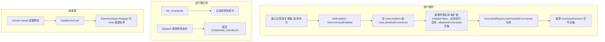

# ext-enable-disable design

## 0. 术语约定

| 术语 | 定义 | 防冲突 |
|---|---|---|
| 隐藏式禁用 | 命令照常编译注册,但从 `list_commands` 隐藏 + dispatch 拒调;不重编译、不删源码 | 本 feature 核心语义 |
| 禁用名单 | 当前所有被禁命令的并集(命令名集合,见 D1 两级粒度算法) | 全新 |
| `ExtensionState` | 启停 API:`SetEnabled`/`SetCommandEnabled`/`Reapply`(roadmap 4.4) | 全新,grep 无 |
| `COMMAND_DISABLED` | dispatch 调到被禁用命令的新错误码 | 全新错误码 |
| `meta.enabled` | 扩展级总开关(false=整扩展禁用) | ext-core 已有字段 |
| `meta.disabledCommands` | 命令级禁用名单([string]),enabled=true 时生效 | 新增字段 |

grep 防冲突:`ExtensionState`/`COMMAND_DISABLED`/`SetDisabledCommands`/`IsDisabled` 均未在代码出现。

## 1. 决策与约束

### 需求摘要
- **做什么**:让用户在管理窗口里**两级粒度**启停已装本地扩展的命令——既能整扩展禁用,也能单条命令禁用;禁用后命令立即从 `list_commands` 消失、AI 调它被拒,但**源码不动、不重编译**;启用恢复。
- **为谁**:使用桥接的开发者(临时关掉某扩展或其中某条命令,不想删它/等重编译)。
- **成功标准**:窗口禁用一个扩展或一条命令 → 对应命令进禁用名单 → `list_commands` 不再列、`commandsVersion` 变化(AI 缓存失效)、dispatch 调到返回 `COMMAND_DISABLED`;启用恢复;状态存 meta(`enabled`/`disabledCommands`),**domain reload 后仍生效**(重应用)。
- **明确不做**:
  - 不重编译 / 不改名 / 不移动 / 不删源码(纯运行时隐藏)——区别于"源码不参与编译"的旧方案。
  - 不做远程 / 安装(纯本地,见 roadmap 重订)。
  - 不做比"命令"更细的粒度(如按参数 / 条件禁用)。

### 复杂度档位
走默认档位。唯一偏离信号是**跨 roadmap 改 file-bridge**(已 completed 的子系统),按 roadmap §4.6 既定契约改,acceptance 回写 architecture。

### 关键决策
- **D1 两级粒度,真相源在 meta**:`SetEnabled(id,bool)` 改扩展级 `meta.enabled`;`SetCommandEnabled(id,cmd,bool)` 增删命令级 `meta.disabledCommands`。**禁用名单算法**:对每个已装扩展——`enabled=false` → 计入其全部 `manifest.commands`;否则 → 计入其 `meta.disabledCommands`;取并集。不另设独立存储,任何时候可由 meta 重算。
- **D2 file-bridge 加禁用名单(roadmap §4.6)**:`CommandRegistry.SetDisabledCommands(names)` / `IsDisabled(name)`;`list_commands` 过滤禁用、`CommandDispatcher` 调到禁用命令返回 `COMMAND_DISABLED`。
- **D3 禁用同时改 `commandsVersion`**:被禁用命令从 `list_commands` **和** `commandsVersion`(内容 hash)双双剔除——这样 AI 一看 version 变了就重拉清单、看到命令消失。否则隐藏了但 version 没变,AI 不刷新会继续按旧缓存调到禁用命令。
- **D4 dispatch 仍能找到 handler**:`TryGet` 不剔除禁用 handler;由 dispatcher 先查 `IsDisabled` 返回 `COMMAND_DISABLED`(比 `UNKNOWN_COMMAND` 更准确,区分"没这命令"与"被禁了")。
- **D5 域重载重应用**:禁用名单是进程内静态状态,domain reload 重置 → extension-manager `[InitializeOnLoad]` 钩子加载后调 `ExtensionState.Reapply()` 读所有 meta 重建名单。
- **D6 窗口加启停按钮**:在 ext-core 的 `ExtensionManagerWindow` 每行加 Enable/Disable 按钮,调 `ExtensionState.SetEnabled`。

### 前置依赖
ext-core(done,提供 manifest/meta 模型、LocalRegistry、窗口、安装目录)。跨 roadmap:file-bridge M3/M5(done,本 feature 改它)。

## 2. 名词与编排

### 2.1 名词层

**现状**:
- file-bridge `CommandRegistry`(`Unity/Editor/Dispatch/CommandRegistry.cs`):`GetAll()` 返回全部注册命令 `Infos`、`Version` 对 `Infos` 算 hash、`TryGet` 取 handler。**无禁用概念**。
- `ListCommandsHandler`(`Commands/ListCommandsHandler.cs`):映射 `GetAll()`。
- `CommandDispatcher`(`Dispatch/CommandDispatcher.cs`):`TryGet` 失败→`UNKNOWN_COMMAND`,否则执行。
- `ErrorCodes`(`Protocol/ErrorCodes.cs`):无 `COMMAND_DISABLED`。
- ext-core:`InstalledMeta.Enabled` 字段已有但无人改、**无 `disabledCommands` 字段**;`LocalRegistry` 读出 `Enabled` 但 UI 没动作;`ExtensionManagerWindow` 无启停按钮。

**变化**:

| 名词 | 角色 | 位置 |
|---|---|---|
| `ErrorCodes.CommandDisabled` | 新错误码 `COMMAND_DISABLED` | file-bridge `Protocol/ErrorCodes.cs`(改) |
| `CommandRegistry.SetDisabledCommands/IsDisabled` | 禁用名单的设入/查询;`GetAll()`+`Version` 改为按可见集(剔除禁用) | file-bridge `Dispatch/CommandRegistry.cs`(改) |
| `CommandDispatcher` 禁用分支 | `IsDisabled`→`COMMAND_DISABLED` | file-bridge `Dispatch/CommandDispatcher.cs`(改) |
| `InstalledMeta.DisabledCommands` | 命令级禁用字段([string]) | `Extensions/InstalledMeta.cs`(改,ext-core 已建) |
| `ExtensionState` | `SetEnabled(id,bool)`/`SetCommandEnabled(id,cmd,bool)`/`Reapply()` | `Unity/Editor/Extensions/`(新) |
| 启停重应用钩子 | `[InitializeOnLoad]` 调 `Reapply()` | `Unity/Editor/Extensions/`(新,可并入 ExtensionState) |
| `ExtensionManagerWindow` 启停 UI | 每扩展行:扩展级启停 + 展开逐命令启停 | `Extensions/ExtensionManagerWindow.cs`(改,ext-core 已建) |

**接口示例**:
```jsonc
// 扩展级:ExtensionState.SetEnabled("my-ext", false)  → meta.enabled=false → 该扩展全部命令进禁用名单
// 命令级:ExtensionState.SetCommandEnabled("my-ext", "do_thing", false)
//        → meta.disabledCommands 增 "do_thing"(meta.enabled 仍 true,只禁这条)
// 两者都触发:重算禁用名单(算法见 D1)→ CommandRegistry.SetDisabledCommands(并集)

// 之后 list_commands 不含被禁命令、commandsVersion 变化;
// dispatch 调被禁命令 → { status:"error", error:{ code:"COMMAND_DISABLED", ... } }

// domain reload 后:[InitializeOnLoad] → ExtensionState.Reapply()
//  → 扫所有 meta(enabled + disabledCommands)重建禁用名单并设入 CommandRegistry
```

### 2.2 编排层

**主流程图**(禁用一个扩展 + 域重载重应用):


**现状 → 变化**:file-bridge 现在"凡注册即可见可调";变化是引入一层禁用名单——可见性/可调性在注册之上再过一道滤网,滤网内容由 extension-manager 按 meta.enabled 维护。**不改注册机制本身**(反射注册照旧)。

**流程级约束**:
- **隐藏≠卸载**:禁用命令的 handler 仍在注册表(`TryGet` 找得到),只是被滤网挡住;启用即恢复,无重编译。
- **真相源单一**:meta(`enabled` + `disabledCommands`)是唯一持久状态;禁用名单是其派生物,任何时候可由 `Reapply()` 从 meta 重建。扩展级优先:`enabled=false` 时该扩展全禁,`disabledCommands` 不再单独生效。
- **缓存一致**:`list_commands` 与 `commandsVersion` 必须基于**同一个可见集**——禁用即从两者剔除(D3),保证 AI 缓存失效信号正确。
- **域重载幂等**:`Reapply()` 幂等(重复调结果一致);加载时序上即便晚于首次 `list_commands`,下一次响应的 `commandsVersion` 也会纠正 AI 缓存。
- **错误语义**:禁用命令被调 → `COMMAND_DISABLED`(不执行 handler);未注册命令仍 → `UNKNOWN_COMMAND`。

### 2.3 挂载点清单

| 挂载位置 | 文件 | 动作 |
|---|---|---|
| 禁用名单设入/查询 | `CommandRegistry`(file-bridge) | 改:加 SetDisabledCommands/IsDisabled + 可见集过滤 |
| dispatch 禁用拒调 | `CommandDispatcher`(file-bridge) | 改:加 COMMAND_DISABLED 分支 |
| list_commands 过滤 | `ListCommandsHandler` + `CommandRegistry.GetAll` | 改:返回可见集 |
| 启停 API | `ExtensionState`(扩展层) | 新增 |
| 域重载重应用 | `[InitializeOnLoad]` 钩子 | 新增 |
| 窗口启停按钮 | `ExtensionManagerWindow` | 改:每行 Enable/Disable |

**拔除**:把 `ExtensionState` + InitializeOnLoad 钩子删掉、`CommandRegistry`/`Dispatcher`/`ListCommandsHandler` 的禁用分支回退、窗口去掉启停按钮、删 `COMMAND_DISABLED` → 系统回到"凡注册即可见"。`meta.enabled` 字段是 ext-core 的,留着无害。

### 2.4 推进策略
```
1. file-bridge 禁用名单底座:ErrorCodes.CommandDisabled + CommandRegistry.SetDisabledCommands/IsDisabled
   + GetAll/Version 改按可见集 + CommandDispatcher 禁用分支
   退出:单测/手测——设入禁用名单后 list_commands 不列该命令、commandsVersion 变、dispatch 调到返 COMMAND_DISABLED
2. ExtensionState + meta 命令级字段:InstalledMeta 加 DisabledCommands;SetEnabled(扩展级)+ SetCommandEnabled(命令级)改 meta + 重算名单(D1 算法)+ 设入;Reapply 扫 meta 重建
   退出:SetEnabled(id,false) 禁整扩展、SetCommandEnabled(id,cmd,false) 只禁单条;Reapply 从 meta 正确重建并集
3. 域重载重应用:[InitializeOnLoad] 钩子调 Reapply
   退出:禁用后触发重编译/重载 → 重载后禁用状态(扩展级+命令级)仍生效
4. 窗口启停 UI:ExtensionManagerWindow 每扩展行加扩展级启停 + 可展开逐命令启停,调 SetEnabled/SetCommandEnabled + 刷新
   退出:窗口扩展级/命令级禁用启用,列表状态与 list_commands 一致;第 3 节验收场景有证据
```

### 2.5 结构健康度与微重构

##### 评估
- compound 检索(目录组织/命名):`commands-category-subdirectory` 约束 `Commands/` 子目录,本 feature 在 `Commands/` 不新增 handler(只改既有 `ListCommandsHandler`),不触发;扩展层延续 `Unity/Editor/Extensions/`。无其它命中。
- 文件级(要改):`CommandRegistry.cs`(现 ~135 行,加禁用集 + 可见集过滤,适度增长不超阈值)、`CommandDispatcher.cs`(加一分支)、`ListCommandsHandler.cs`(改数据源)、`ErrorCodes.cs`(加常量)、`InstalledMeta.cs`(加 DisabledCommands 字段)、`ExtensionManagerWindow.cs`(加扩展级+逐命令启停 UI)。均小幅改动,无胖文件。
- 目录级:`Extensions/` 加 1-2 文件(ExtensionState + 可能的 InitializeOnLoad 钩子);现 8 文件 → 9-10。略增但仍属单模块合理范围。

##### 结论:不做(微重构)
改动分散在既有文件的小增量 + 扩展层少量新文件,无文件偏胖/目录摊平到需要先重构。

##### 超出范围的观察
- ext-core 远程死代码(InstallFromGitHub/zip 下载/窗口粘 URL 控件)仍在,roadmap §7 已记 → 建议**单独** `cs-refactor` 清理。本 feature 改窗口时**只加启停按钮,不顺手删远程控件**(避免功能 PR 混入重构);如启停按钮与粘 URL 控件布局冲突,最小调整并在汇报标注。

## 3. 验收契约

### 关键场景清单
1. **扩展级禁用**:`SetEnabled(id,false)` → 该扩展**全部** `commands` 不再出现在 `list_commands`;`commandsVersion` 变化。
2. **命令级禁用**:`SetCommandEnabled(id,cmd,false)`(扩展仍 enabled)→ **仅 `cmd`** 从 `list_commands` 消失,同扩展其它命令仍在;`commandsVersion` 变化。
3. **禁用拒调**:禁用的命令(无论扩展级还是命令级)经桥接调 → `error.code = COMMAND_DISABLED`(handler 不执行)。
4. **启用恢复**:`SetEnabled(id,true)` / `SetCommandEnabled(id,cmd,true)` → 对应命令重现 `list_commands`、`commandsVersion` 再变、可正常调用。
5. **优先级**:扩展级 `enabled=false` 时整扩展禁用,与 `disabledCommands` 无关;启用扩展后 `disabledCommands` 恢复生效。
6. **持久 + 重应用**:禁用(任一粒度)后触发 domain reload / 重开编辑器 → 重载后禁用状态仍生效(`list_commands` 不含、调用仍 `COMMAND_DISABLED`)。
7. **真相源**:meta(enabled+disabledCommands)与实际禁用一致;手动改 meta 后 `Reapply()` 能纠正名单。
8. **窗口**:每扩展行有扩展级启停 + 可展开逐命令启停,点击后列表状态 + `list_commands` 同步。
9. **多扩展并存**:禁 A 的某命令不影响 B;禁用名单是并集。

### 明确不做的反向核对项
- 禁用**不删源码、不重编译、不改名/移动**:grep 禁用路径无 `File.Delete`/`File.Move`/`.cs.disabled`/`AssetDatabase.Refresh`(启停不 Refresh——纯运行时)。
- 禁用 handler 仍在注册表:`CommandRegistry.TryGet` 不因禁用返回 false(dispatch 靠 `IsDisabled` 判定,非 `TryGet` 失败)。
- 不引入远程 / 安装逻辑(纯本地)。
- 不做比命令更细的粒度(无按参数/条件禁用)。

## 4. 与项目级架构文档的关系

acceptance 提炼回 `architecture/ARCHITECTURE.md`:
- **file-bridge 改动(重点)**:M3/M5 引入"禁用名单"——`list_commands`/`commandsVersion` 基于可见集、dispatch 新增 `COMMAND_DISABLED`。这是对 file-bridge 既有"凡注册即可见"约束的修订,需更新 §5 已知约束 + §3 M3/M5 描述。
- **扩展子系统**:EM4 启停落地 → 更新"扩展管理子系统"小节(扫描/卸载之外多了启停)。
- **req 对齐**:`requirement extension-management` 文案(提到 GitHub 安装)已过时,acceptance 时按纯本地刷新(roadmap §7 观察项)。

关联:roadmap `extension-manager` §4.2/4.4/4.6(硬约束);跨 roadmap 改 file-bridge(`command-discovery-mechanism` 决策的 `commandsVersion` 语义受影响——禁用纳入 hash);decision `commands-category-subdirectory`(本 feature 不在 Commands/ 加 handler,不触发)。
