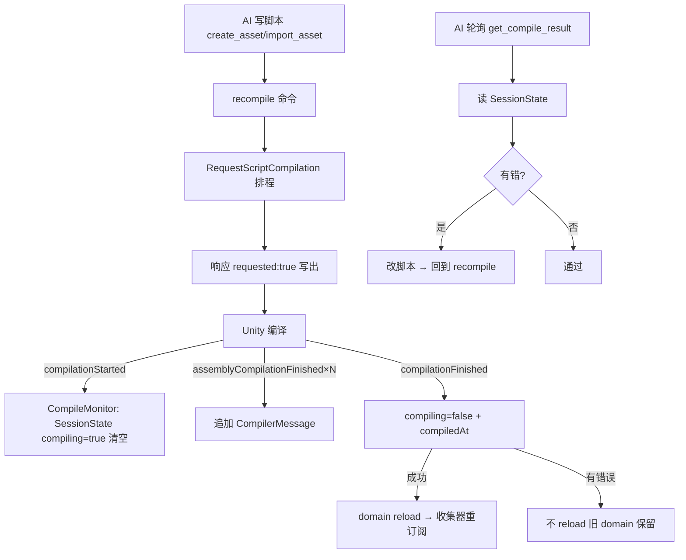

# cmd-compile-check 设计

## 0. 术语约定

| 术语 | 含义 |
|---|---|
| `recompile`(命令) | 触发 Unity 脚本重编译(`CompilationPipeline.RequestScriptCompilation()`),立即返回 `{requested:true}` |
| `get_compile_result`(命令) | 读最近一次编译结果:`{compiling, compiledAt, errorCount, warningCount, errors[], warnings[]}`,errors 与 warnings **分两个数组**返回 |
| `CompileMonitor` | `[InitializeOnLoad]` 静态收集器,订阅 `CompilationPipeline` 事件,把编译消息写入 `SessionState`(跨 domain reload 存活) |
| `CompileMessage` | 一条编译消息 DTO:`{file, line, column, message, type}`(type = error/warning) |
| `CompileResult` | 持久化的整次编译快照:`{compiling, compiledAt, errorCount, warningCount, messages[]}`(`get_compile_result` 输出时按 type 拆成 errors/warnings 两数组) |
| `SessionState` | Unity 编辑器键值存储——**跨 domain reload 存活、编辑器重启清空**,正适合 session 级编译状态 |

> 防冲突:`recompile`/`get_compile_result`/`CompileMonitor` grep 全仓无命中(新概念)。

## 1. 决策与约束

### 需求摘要
AI 通过桥接写脚本(`create_asset`/`import_asset`)后,需要知道"编了没、报没报错、错在哪",形成**写代码→自检报错→修复**闭环,而不必让用户切到 Unity 肉眼看 Console。

### 复杂度档位
走默认档位。唯一偏离信号是 **domain reload 异步性**(下面关键决策 D1)。

### 关键决策
- **D1 两命令而非一条同步命令**:Unity 触发脚本编译会 **domain reload**——当前请求若在编译期处于 `processing/`,会被现有机制补成 `INTERRUPTED`(见 `AgentBridgeHost.ReclaimOrphans`)。故"一条命令同步编译并返回结果"在本桥接模型下**不可能**。拆为:`recompile`(触发,立即返回)+ `get_compile_result`(reload 后读结果)。
  - `recompile` 自身能干净返回:`RequestScriptCompilation()` 把编译排到当前 update 之后,handler 同步返回 → 响应在 reload 前写出 → 释放 processing。编译/ reload 随后才发生。
- **D2 持久化用 `SessionState` 而非文件**:编译结果是 **session 级**状态(下次重启编辑器就该清),`SessionState` 跨 reload 存活、重启自动清,语义恰好;落 `AgentBridge/` 下文件会跨重启残留陈旧结果。
- **D3 专用 `recompile` 命令而非复用 `refresh`**:`RequestScriptCompilation` 显式强制重编译(即使无资产变化也编),与资产导入解耦;`refresh`(`AssetDatabase.Refresh`)只在检测到资产变化时才连带编译,不可靠。`refresh` 维持现状只管资产。
- **D4 收集器跨三事件**:`CompileMonitor` 订阅 `compilationStarted`(清空 + `compiling=true`)/ `assemblyCompilationFinished(asm, CompilerMessage[])`(逐程序集追加消息)/ `compilationFinished`(`compiling=false` + 盖 `compiledAt`)。`[InitializeOnLoad]` 保证它在"跑这次编译的那个 domain"里活着接到事件、并在 reload 后重新订阅。
- **D5 错误语义**:`get_compile_result` 永远 `ok` 带结果体(尚无编译 → `compiledAt:null`、空数组;编译中 → `compiling:true`)。`recompile` 返回 `{requested:true}`。两命令均可被命令管理器禁用(→ `COMMAND_DISABLED`,复用现有机制)。
- **D6 测试边界**:真实"编译 + domain reload"无法在 EditMode 测试里可靠驱动(EditMode 不可控触发 reload)。**新命令必带测试**规约按可测部分满足:单测 `CompileMonitor` 的 `CompilerMessage→CompileMessage` 映射 + `get_compile_result` 读"预置 SessionState"的结果(含 errors/warnings 拆分);真实"写错码→recompile→读到 error"闭环走**活体验证**(同往返活体测,AI 写请求文件驱动真 Unity)。这是对该规约的显式、有记录的边界,不是省略。

### 这功能放哪儿
新命令域 **Compilation**——既不属 Inspection(只读)、Mutation(场景写)、Assets(资源)。按 decision `commands-category-subdirectory` 落 `Commands/Compilation/`;收集器(非命令的桥接 infra)落 `Editor/Compilation/`。建在 M3 handler 框架之上,零侵入(实现 `ICommandHandler` 即注册)。

### 前置依赖
无。复用现有 M3 框架 + commandsVersion + 禁用机制。

## 2. 名词与编排

### 2.1 名词层

**现状**:命令域只有 Inspection/Mutation/Assets + 元命令;无任何编译相关命令或编译状态收集。`ErrorCodes`(`Unity/Editor/Protocol/ErrorCodes.cs`)有通用码;无编译专属码(本 feature 也不需要——编译错误是数据不是命令错误)。

**变化**:
- 新增命令 `recompile`(`ICommandHandler`,`Commands/Compilation/`)。示例:
  ```
  请求 {command:"recompile"}  →  {status:"ok", result:{requested:true}}
  ```
- 新增命令 `get_compile_result`。示例(写了个少分号的脚本并 recompile 后):
  ```
  {command:"get_compile_result"} → {status:"ok", result:{
    compiling:false, compiledAt:"2026-06-26T...Z", errorCount:1, warningCount:0,
    errors:[{file:"Assets/Foo.cs", line:12, column:9, message:"; expected", type:"error"}],
    warnings:[]
  }}
  ```
  尚无编译:`{compiling:false, compiledAt:null, errorCount:0, warningCount:0, errors:[], warnings:[]}`。编译中:`{compiling:true, ...}`。
- 新增 `CompileMonitor`(静态 `[InitializeOnLoad]`,`Editor/Compilation/`)——订阅 `CompilationPipeline` 三事件,读写 `SessionState`(键如 `AgentBridge.CompileResult`)。来源:UnityEditor.Compilation。
- 新增 DTO `CompileMessage` / `CompileResult`(`Editor/Compilation/`)——序列化进 `get_compile_result` 结果 + SessionState JSON;输出时按 `type` 把 messages 拆成 `errors[]`/`warnings[]`。

### 2.2 编排层



**现状**:`AgentBridgeHost.Tick` 排空请求 → `CommandDispatcher.Dispatch` → 写响应。无编译参与。

**变化**:不改主循环。新增的是 dispatch 之外的旁路收集器 `CompileMonitor`,与命令解耦——命令只读/写 SessionState,事件采集独立发生。

**流程级约束**:
- **recompile 命令必须在 reload 前返回**:handler 仅调 `RequestScriptCompilation()` 后立即 return(不阻塞等编译),保证响应写出 + processing 释放先于 reload。
- **结果跨 reload 一致**:只经 `SessionState` 传递(reload 存活);收集器是结果的唯一写入方,命令只读。
- **幂等/可观测**:`get_compile_result` 只读、可任意次调用;`compiling` 标志让 AI 知道该等(轮询)。
- **编译错误 ≠ 命令错误**:编译报错时 `get_compile_result` 仍 `status:ok`,错误在 `result.errors` 里(数据);命令本身不失败。

### 2.3 挂载点(删了它 feature 即消失)
- `Commands/Compilation/RecompileHandler.cs` — 删 → `recompile` 命令消失。
- `Commands/Compilation/GetCompileResultHandler.cs` — 删 → `get_compile_result` 消失。
- `Editor/Compilation/CompileMonitor.cs` — 删 → 编译结果不再被采集(命令读到空)。
- (SessionState 键、DTO 是运行数据/内部类型,非挂载点。)

反向核查:本 feature 不往 host/dispatch/registry 插桩——纯靠 M3 自动注册 + 独立收集器。卸载 = 删上述 3 文件(+ DTO),无残留。

### 2.4 推进策略(paradigm 切片)
1. **收集器 + DTO**:`CompileMessage`/`CompileResult` + `CompileMonitor`(订阅三事件,读写 SessionState)。退出:编辑器里手动改个脚本触发编译,SessionState 里能看到结果 JSON(开发期 Debug 验证)。
2. **命令层**:`recompile` + `get_compile_result` 两 handler(后者把 messages 按 type 拆 errors/warnings)。退出:`list_commands` 含两命令;`get_compile_result` 经 Dispatch 返回结果体结构正确。
3. **测试**:单测 `CompileMonitor` 消息映射 + `get_compile_result` 读预置 SessionState(含 errors/warnings 拆分,见 D6 边界);活体验证真实编译闭环。退出:EditMode 测试绿 + 活体写错码能读到 error。

### 2.5 结构健康度与微重构
- compound 查 `commands-category-subdirectory` 命中 → 直接照办:命令落 `Commands/Compilation/`。
- 文件级:全新增,不改现有文件。目录级:新建 `Commands/Compilation/` 与 `Editor/Compilation/`,均不挤。
- **结论:不做微重构**——全新增、独立目录,生产代码零触碰既有逻辑。
- 超出范围的观察:无。

## 3. 验收契约(关键场景)

- **S1 recompile 触发**:`{command:"recompile"}` → `status:ok`、`result.requested=true`;Unity 实际发生一次重编译(活体可观察 Console / 后续 get_compile_result 的 compiledAt 更新)。
- **S2 干净代码**:编译无错后 `get_compile_result` → `compiling:false`、`errorCount:0`、`errors:[]`。
- **S3 错误代码**:写一个含语法错的脚本 → recompile → `get_compile_result` → `errorCount≥1`,`errors[0]` 含 `file`/`line`/`message`/`type:"error"`。
- **S4 尚无编译**:本 session 未编译过 → `get_compile_result` → `compiling:false`、`compiledAt:null`、空数组(不报错)。
- **S5 编译中**:编译进行中查询 → `compiling:true`(AI 据此继续轮询)。
- **S6 跨 reload 存活**:成功编译触发 domain reload 后,`get_compile_result` 仍能读到该次结果(SessionState 存活)。
- **S7 warnings 拆分**:有警告无错误时 → `errorCount:0`、`warningCount≥1`,`warnings[]` 非空、`errors[]` 空(errors/warnings 分两数组)。
- **S8 禁用**:命令被管理器禁用 → dispatch 返 `COMMAND_DISABLED`、从 `list_commands` 剔除。

**反向核对项(明确不做)**:
- 不做"一条命令同步编译并返回结果"(domain reload 不允许;grep 无单命令内 `RequestScriptCompilation` 后读结果再返回的逻辑)。
- 不持久化到 `AgentBridge/` 下文件(用 SessionState;grep 收集器无文件写)。
- 不改 `refresh` 语义、不改主循环 `AgentBridgeHost.Tick`/dispatch。
- 不在 EditMode 测试里驱动真实编译+reload(D6;测试只覆盖映射 + 读预置 SessionState)。
- 不返回编译产物/IL/程序集列表——只回 error/warning 消息。

## 4. 与项目级架构文档的关系

- `architecture/ARCHITECTURE.md`:M5 内置命令集新增 **Compilation 域**(`recompile`/`get_compile_result`);新增"编译自检子系统"一句——`CompileMonitor` 经 `SessionState` 跨 reload 收集 `CompilationPipeline` 消息,命令只读。§5 已知约束补一条"编译触发 domain reload,故编译自检为异步两步(recompile + get_compile_result)"。归并在 accept 阶段做。
- requirement `agent-editor-control`:current,本 feature 加"AI 自检编译错误"子能力 → accept 时加变更日志(用户视角 pitch 未变)。
- attention.md:候选——"改脚本/触发编译会 domain reload 打断在途请求;编译自检须 recompile 后轮询 get_compile_result"。accept 第 8 节定。
